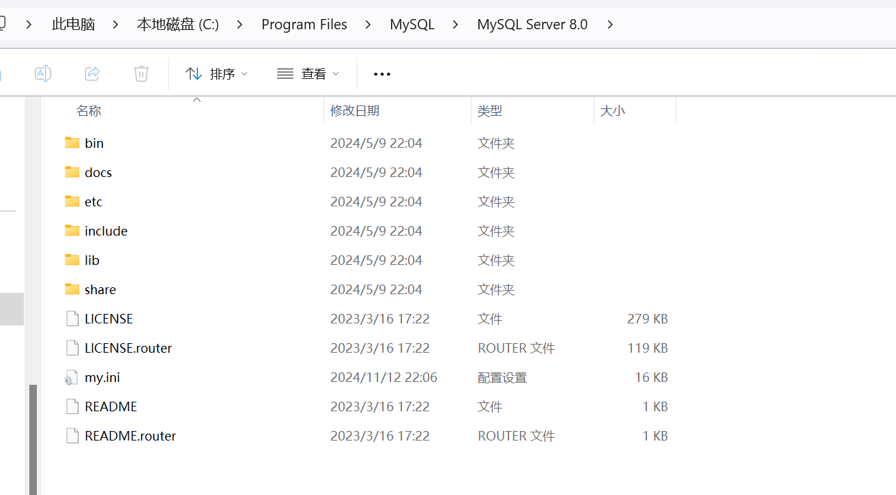
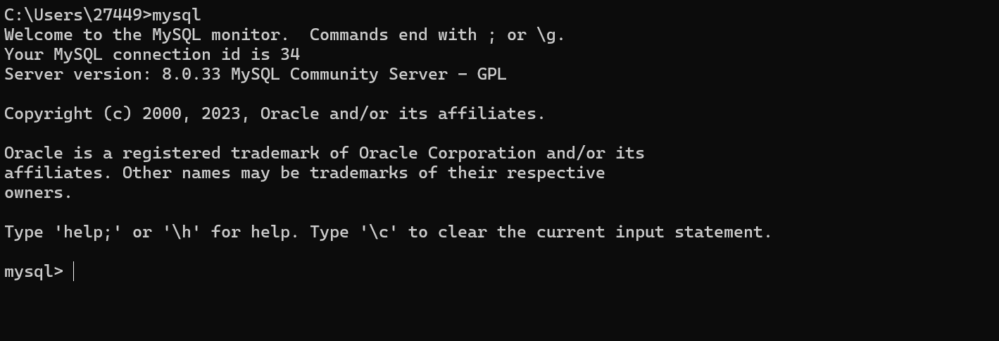

# Mysql

1.数据定义语言（Data Definition Language，DDL），主要是用在定义或改变

表的结构、数据类型、表之间的连接和约束等初始化工作上，比如 create、alter、drop

等。

2.数据库创建和维护的DDL语句：

```mysql
数据库创建和维护的DDL语句：
 create database database_name 创建数据库
 show databases 查看数据库
 drop database database_name 删除数据库
 rename database old_database_name to new_database_name 更改数据库名
 
 数据库表创建：
 create table table_name(
 字段名 1, 数据类型【列级别约束条件】【默认值】,
 字段名 2, 数据类型【列级别约束条件】【默认值】,
 ...
 【列级别约束条件】
 )
 演示例子：
 CREATE TABLE `t_user` (
 `ID` int(11) NOT NULL AUTO_INCREMENT COMMENT '主键ID',
 `NAME` varchar(50) NOT NULL COMMENT '用户名',
 `PASSWORD` varchar(10) DEFAULT NULL COMMENT '用户密码',
 PRIMARY KEY (`ID`)
 ) ENGINE=InnoDB AUTO_INCREMENT=10 DEFAULT CHARSET=gbk;
```

3.数据库表结构修改

```mysql
alter table 表名 修改子句
修改子句类型：
新增字段子句：
add column_name data_type [not null] [default default_value]变更字段名子句：
change column_name new_column_name data_type [not null] [default default_value]
更新字段类型子句：
modify column_name new_data_type [not null] [default default_value]
删除字段：
drop column column_name
删除约束：
drop unique constraint_name;//删除唯一约束
drop constraint 约束名；//删除约束
drop primary key;//删除主键
```

4.数据操作语言DML，实现对数据库中数据的操作，以 insert、update、

delete 3 种指令为核心，分别代表插入、更新与删除。

* 插入语句

```mysql
语法结构：如果同时插入多行则values后跟多个(值列表)，以逗号相隔
insert [into] table_name[( 字段列表 )] values( 值列表 )
例子：
 insert into t_user(USER_NAME,PASSWORD,address)
 values('张三','11111111','云南农职学院');
```

* 更新语句：使用“update”SQL 语句来操作，该语句可以对表中的一行、多行甚至

  所有记录进行修改

  ```mysql
   语法结构：
   update table_name set
   字段名 1= 值 1, 字段名 2= 值 2, … , 字段名 n= 值 n [where 条件表达式 ]
   例子：
   update t_user set USER_NAME=concat('欧阳',USER_NAME); //concat在USER_NAME前加上欧阳两个字
  ```

* 删除语句：

  ```mysql
  语法结构：
   delete from table_name [where 条件表达式 ]
   注意：当删除有主从关系的表记录时，为避免发生删除时异常，一定要事先设置从表
   外键约束的“删除时”状态为 null，或者为“cascade”。在通常情况下，都是设置从表
   外键约束的“删除时”状态为 null，而不是“cascade”，因为这样容易误删除从表数据。
  
   例子：
   DELETE from t_user where USER_NAME='欧阳张三'
  ```

##  数据查询

1. select语句基本结构

（1）概念：select 语句可以使数据库服务器根据客户的要求查询所需要的信息，并按规定

的格式返回给客户

（2）select语法结构：

```mysql
select <column1, column2, column3 … > from <table_name>

 [where < 条件表达式 >]

 [group by column1, column2, column3 … | having < 条件表达式 >]

 [order by < column1, column2, column3 … > [asc 或 desc]]
```

（3）字段取别名，表取别名，按需查字段

```mysql
select shopName as 商家名 , shopAddress as 商家地址 from product shop


 例子：
 SELECT * from t_user;
 select user_name as '姓名' ,password as '密码' from t_user as userinfo
```

2. 查询结果排序

* order by 字段名 排序方式:

* 可以对查询结果按照“字段 1，字段 2…”的次序进行升序或降序显示。

* 关键字 asc 表示升序（默认为升序，故升序时可省略 asc），desc 表示降序。

* 多列排序的规则为：依照排序列从左至右的次序依次降低

```mysql
SELECT * from t_user u order by id desc,phone asc;
```

3.过滤重复字段

```mysql
distinct：用于过滤重复的字段信息。
select distinct director from movie
```

4.限定指定记录

limit子句：MySQL 提供的 limit 子句可以被用于强制select 语句返回指定的记录数。

**limit [offset,] rows**

* 参数 offset 和 rows 必须为整数，offset 可以省略。

* offset 指定第一个返回记录行的偏移量。注意：初始记录行的偏移量是 0，而不是 1。

* rows 指定返回记录行的最大数目

```mysql
select movieName 电影名 ,filmLength 片长（分钟） from movie
order by filmLength
limit 0,5
```

5.模糊查询

like 运算符：进行模式匹配查询

通配符：

* n%：包含零个或多个字符的任意字符串；
* n_（下划线）：任意单个字符；
* n_（下划线）：任意单个字符；
* n[^]：不属于指定范围（如 [^a-d]）或集合（[^abcdef]）中的任意单个字符；

```mysql
例子：
 select movieName 电影名 ,filmLength 片长（分钟） from movie where actors like ‘%黄%’
```


## 聚合函数和分组统计

一、聚合函数

（1）概念：聚合函数是 SQL 基本函数，它对一组值执行计算，并返回单个值。

（2）聚合函数：除了 count(*) 函数以外，聚合函数都会忽略空值。

​	1.SQL Aggregate 函数

​	SQL Aggregate 函数计算从列中取得的值，返回一个单一的值。

​	有用的 Aggregate 函数：

- AVG() - 返回平均值
- COUNT() - 返回行数
- FIRST() - 返回第一个记录的值
- LAST() - 返回最后一个记录的值
- MAX() - 返回最大值
- MIN() - 返回最小值
- SUM() - 返回总和

​	2.SQL Scalar 函数

​	SQL Scalar 函数基于输入值，返回一个单一的值。

​	有用的 Scalar 函数：

- UCASE() - 将某个字段转换为大写
- LCASE() - 将某个字段转换为小写
- MID() - 从某个文本字段提取字符，MySql 中使用
- SubString(字段，1，end) - 从某个文本字段提取字符
- LEN() - 返回某个文本字段的长度
- ROUND() - 对某个数值字段进行指定小数位数的四舍五入
- NOW() - 返回当前的系统日期和时间
- FORMAT() - 格式化某个字段的显示方式

```mysql
例子：
 获取电影的数量、最长片长、最短片长和平均片长
 select count(*) 数量 ,max(filmLength)（分钟） 最长片长 ,
 min(filmLength) 最短片长（分钟）,avg(filmLength) 平均片长（分钟） from movie
 select count(director) 导演信息不为空的电影数量 from movie
```

二、group by分组统计

（1）概念：group by 子句可以将数据划分到不同的组中，实现对记录的分组统计

（2）语法结构：

```mysql
group by 字段列表 [having 条件表达式 ]
 例子：
 select typeID 类型 ID,count(*) 数量 ,avg(filmLength) 平均片长（分钟）,
 max(ticketPrice) 最高票价（元） from movie
 where ticketPrice<=100 ‐‐分组前过滤
 group by typeId
 having avg(filmLength)>100 ‐‐对分组结果过滤
 order by avg(filmLength)
```

三、连接查询

1.内连接查询


（1）概念：内连接也称为连接，它还可以被称为完全匹配连接。 内连接使用比较运算符比较每个表共有的列的值。

（2）语法结构

```mysql
 select fieldlist from table1
 [inner] join table2
 on table1.column1=table2.column2 ‐‐column1 和 column2 通常为主键和外键
```

2.多表连接查询

如果在 from 子句中，直接列出所有要连接的表，然后在 where 子句中指定连

接条件，此为简单多表查询。简单多表连接查询是内连接查询的简单表现形式，它与内连接查询的功能相同。

```mysql
select fieldlist from table1, table2 where table1.column1=table2.column2
```

3.外连接查询

（1）概念：外连接可以是左外连接、右外连接或全连接.（what）在内连接查询中，只有满足连接条件的记录才能出现在查询结果中。但在实际应用中，如果希望不满足连接条件的记录也在查询结果中出现，这时就需要使用外连接查询。(why)

（2）左外连接（left join）


结果集包括 left join 子句中指定的**左表**的所有行，而不仅仅是连接列所匹配的行。如果左表的某行在右表中没有匹配行，则在相关联的结果集行中右表的所有选择列表列均为空值

```mysql
例子：
 ‐‐需求
 采用左外连接方式显示所有电影的相关信息，要求输出电影名、导演名、票价和类型
 ‐‐sql语句
 select movieName 电影名 ,director 导演名 ,ticketPrice 票价（元）,typeName类型
 from movie m
 left join movie_type mt
 on m.typeId=mt.id
```

（3）右外连接（right join）


​	右外连接是左外连接的反向连接，它返回右表的所有行。

​	如果右表的某行在左表中没有匹配行，则在相关联的结果集行中，表的所有选择列表列均为空值。

```mysql
 例子：
 ‐‐需求：
 采用右外连接方式显示所有电影类型的相关信息，要求输出电影名、导演名、票价和类型。
 ‐‐sql语句：
 select movieName 电影名 ,director 导演名 ,ticketPrice 票价（元）,typeName类型
 from movie m right join movie_type mt on m.typeId=mt.id
```

（4）全连接（full join）


全连接返回左表和右表中的所有行。

当某行在另一个表中没有匹配行时，则另一个表的选择列表列包含空值。

```mysql
SELECT column_name(s)
FROM table1
FULL OUTER JOIN table2
ON table1.column_name=table2.column_name;
```

**注意：MySQL中不支持 FULL OUTER JOIN**，你可以在 SQL Server 测试以下实例

```mysql
SELECT Websites.name, access_log.count, access_log.date
FROM Websites
FULL OUTER JOIN access_log
ON Websites.id=access_log.site_id
ORDER BY access_log.count DESC;
```

## 子查询

**1**、**子查询：**将一个查询语句嵌套在另一个查询语句中，在特定情况下，一个查询语句的条

件需要另一个查询语句来获取，内层查询语句的查询结果可以为外层查询语句提供查询条

件。

**2、子查询使用方式**：

可用于 where 子句中;

还能够用于 from 子句中作为一个临时表;

以字段的形式出现在 select 语句的选择列中

**3、分类**

**子查询中只查一个字段的值；**

根据子查询所返回的结果行数，可以将其分为单行子查询和多行子查询

###  一、单行子查询

**1、概念**

单行子查询指子查询的返回结果只有一行数据。

当在主查询的条件语句中引用子查询的结果时，**可使用单行比较符（如＝、>、**

**<、>=、<= 和 < >）进行比较**。

**2、使用例子(how)**

**从内到外，逐层分析**

有连接关系的两个表进行子查询：

```mysql
 第一例子：
 ‐‐ 用子查询实现查询所有张三下过的订单
  A第一步：
 SELECT WORKER_ID FROM T_WORKER w WHERE w.NAME='张三'
 B第二步：
 SELECT * FROM T_ORDER o where o.CASHIER_ID=(
 SELECT WORKER_ID FROM T_WORKER w
 WHERE w.NAME='张三')
 第二例子（子查询使用聚合函数）：
 ‐‐ 用子查询实现查询价格高于或等于所有订单平均价格的订单
 A第一步：
 SELECT AVG(MONEY) FROM T_ORDER
 B第二步：
 SELECT * FROM T_ORDER o
 WHERE o.MONEY >(
 SELECT AVG(MONEY) FROM T_ORDER )
```

总结：

**子查询使用归纳：**

* 子查询一般用于 select 语句的 where 子句中，且可以嵌套。

* 编写复杂的子查询的解决思路是**逐层分解查询**，即从最内层的子查询开始分解，将嵌套的 SQL 语句拆分为一个个独立的 SQL 语句。

* 子查询的执行过程遵循“由里及外”的原则，即先执行最内层的子查询语句，然后将执行结果与外层的语句进行合并，依次逐层向外扩展并最终形成完整的 SQL 语句。

* 一般情况下，连接查询可改为子查询实现；但子查询却不一定可改为连接查询实现。

* 子查询与连接查询执行效率的比较：当子查询执行结果的行数较大，而主查询执行结果的行数较小时，子查询执行效率较高；反之，则连接查询执行效率较高。

### 二、多行子查询的应用

**1.in 比较符**

**(1)概念(what)**

使用多行比较符 in 时，主查询会与子查询中的每一个值进行比较，如果与其中的任意一个值相同，则返回。

not in 与 in 的含义恰好相反。

单行子查询也是多行子查询的一种特殊情况，所以单行子查询的“=”比较符可以替换为多行子查询的“in”比较符。但不能将多行子查询的“in”比较符替换为单行子查询的“=”比较符。

```msyql
 ‐‐ 用子查询实现查询所有张三和李四下过的订单
 SELECT * FROM T_ORDER o
 where o.CASHIER_ID in(
 SELECT WORKER_ID FROM T_WORKER w
 WHERE w.NAME='张三' OR w.NAME='李四'
 )
```

**2.all 关键字子查询**

**（1）概念：(what)**

通过 all 关键字将一个表达式或列的值与子查询所返回的一列值中的每一行进行比较，

只要有一次比较的结果为 false（假），则 all 测试返回 false，主查询不执行；否则返

回 true，执行主查询。

(2)语法结构

表达式或字段 单行比较运算符 all( 子查询 )

（3）all运算符含义

* all 关键字位于单行比较运算符之后；

* 当 <all 时，表示小于最小值（all后面跟着的子查询里的）,等价于“<(子查询里取最小值)”。

* 当 >all 时，表示大于最大值（all后面跟着的子查询里的）,等价于“>(子查询里取最大值)”。

```mysql
‐‐ 查询李四下的订单中高于张三下的所有订单金额的订单
 SELECT * FROM T_ORDER o
 WHERE o.CASHIER_ID in(
 SELECT WORKER_ID FROM T_WORKER w
 WHERE w.NAME='李四'
 ) AND
 o.MONEY > ALL(
 SELECT MONEY FROM T_ORDER WHERE CASHIER_ID in(
 SELECT WORKER_ID FROM T_WORKER wo
 WHERE wo.NAME='张三'
 )
 )
 等价于：
 SELECT * FROM T_ORDER o
 WHERE o.CASHIER_ID in(
 SELECT WORKER_ID FROM T_WORKER w
 WHERE w.NAME='李四'
 ) AND
 o.MONEY > (
 SELECT MAX(MONEY) FROM T_ORDER WHERE CASHIER_ID in(
 SELECT WORKER_ID FROM T_WORKER wo
 WHERE wo.NAME='张三'
 )
 )
```

**3.any|some 关键字子查询**

**（1）概念：(what)**

any 与 some 的查询功能相同。

any 或 some 用于子查询之前，通过 any|some 比较运算符，将一个表达式或列的值与子查询所返回的一列值中的每一行进行比较，只要有一次比较的结果为 true，则 any 或 some 测试返回true，主查询执行；否则结果为false，主查询不执行。

(2)语法结构

表达式或字段 多行比较运算符 any（子查询）

表达式或字段 多行比较运算符 some（子查询）

（3）**any|some**运算符含义

**any|some**关键字位于比较运算符之后；

当 <any|some 时，表示小于最大值（后面跟着的子查询里的）,等价于“<(子查询里取最大值)”。

当 =any|some 时，表示与 in 运算符等价当 >any|some 时，表示大于最小值（后面跟着的子查询里的）,等价于“>(子查询里取最小值)”。

```mysql
需求：
 ‐‐ 查询李四下的订单中高于张三下的任意一个订单金额的订单
 SELECT * FROM T_ORDER o
 WHERE o.CASHIER_ID in(
 SELECT WORKER_ID FROM T_WORKER w
 WHERE w.NAME='李四'
 ) AND
 o.MONEY > SOME(
 SELECT MONEY FROM T_ORDER WHERE CASHIER_ID in(
 SELECT WORKER_ID FROM T_WORKER wo
 WHERE wo.NAME='张三'
 )
 )
```

**4.****select 子句中的子查询**

**（1）概念：**

select 子句中使用子查询，其实质是将子查询的执行结果作为 select 子句的列，可以起到与连接查询异曲同工的作用。且此处的子查询只能查一列，多于一列执行出错

```mysql
‐‐ 为了了解张三的业绩情况，查所有订单数及张三下的订单数所对比
 select count(*) as '所有订单数',
 (select count(*) from t_order ord where ord.CASHIER_ID=(
 SELECT WORKER_ID FROM T_WORKER w
 WHERE w.NAME='张三'
 )
 ) as '张三下单数'
 from t_order
```

**5.****exists 子查询的用法**

**（1）概念：**

* exists 用于检查子查询是否至少会返回一行数据。该子查询实际上并不返回任何数据，而是返回值 true 或false。

* exists 子查询的返回结果若为 true，则执行主查询获得所有预订电影票的客户姓名；exists 子查询的返回结果若为 false，则不执行主查询。

（2）语法结构：

主查询表达式 [not] exists ( 子查询 )

```mysql
‐‐ 查询被点过的餐品信息
 SELECT f.* FROM t_food f
 where EXISTS(
 select * from
 t_orderdetail od
 where f.FOOD_ID=od.FOOD_ID
 )
 ‐‐ 查询没有被点过的餐品信息
 SELECT f.* FROM t_food f
 where not EXISTS(
 select * from
 t_orderdetail od
 where f.FOOD_ID=od.FOOD_ID
 )
```


## mysql 8.0

1.运行项目时报错：Public Key Retrieval is not allowed

```
解决 方案一：
命令行模式执行:
ALTER USER 'root'@'localhost' IDENTIFIED WITH mysql_native_password BY 'root';
或者 
ALTER USER 'root'@'%' IDENTIFIED WITH mysql_native_password BY 'root';

方案二：
在配置数据源的时候直接将属性allowPublicKeyRetrieval设置为true即可

jdbc.driverClass = com.mysql.cj.jdbc.Driver
jdbc.jdbcUrl = jdbc:mysql://127.0.0.1:3306/bank?useSSL=false&useUnicode=true&allowPublicKeyRetrieval=true&characterEncoding=utf8
jdbc.user = root
jdbc.password = 123456
```

 mysql 8.0

###### win11 界面报错,显示无权限

```
Access denied for user ''@'localhost' (using password: NO)
```

把文件my.ini移动到mysql8.0安装目录下：

```
C:\Program Files\MySQL\MySQL Server 8.0
```



如果出现以下内容则windowsMysql问题解决


