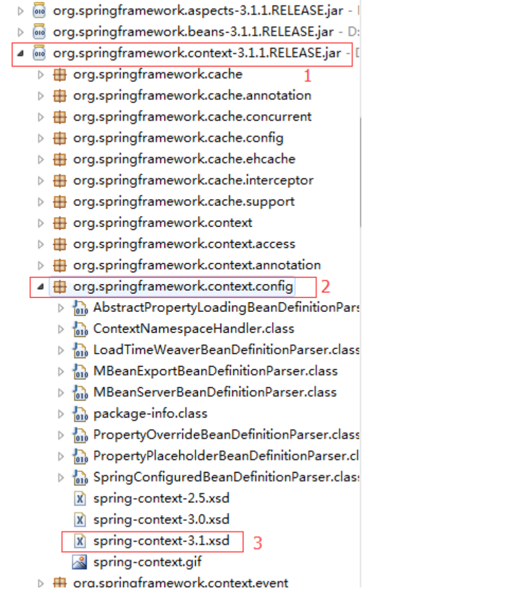
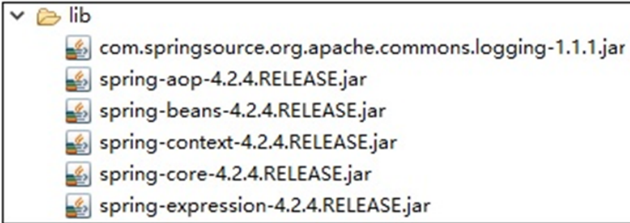

# Spring

Spring是一个开源框架，Spring是于2003年兴起的一个轻量级的Java开发框架.

Spring的核心是依赖注入、控制反转和面向切面编程。

## 一、spring使用bean标签创建对象(本质是通过构造方法实例化对象)

```
//1.applicationContext.xml配置bean标签
 <?xml version="1.0" encoding="UTF‐8"?>
 <beans xmlns:xsi="http://www.w3.org/2001/XMLSchema‐instance"
 xmlns="http://www.springframework.org/schema/beans"
 xsi:schemaLocation="http://www.springframework.org/schema/beans
 http://www.springframework.org/schema/beans/spring‐beans‐4.2.xsd">
 <bean id="food" class="com.ynnz.pojo.Food"></bean>
 </beans>

 //2.测试代码获取对象
 public static void main(String[] args) {
 // TODO Auto‐generated method stub
 // 1.获取上下文(加载核心配置文件)

 ApplicationContext context = new ClassPathXmlApplicationContext("applic
ationContext.xml");
 //2.获取配置中Food实例
 Food food = (Food) context.getBean("food");
 // 输出结果
 System.out.println(food);
 }
```

1.set注入方式（spring注入属性）

属性必须有set方法

* 注入方式

 	Spring框架提供了4种常用的属性注入方式，set注入、构造方法注入、p命名空间注入

​	以及表达式spel方式注入。

* 通过set注入方式，使用property元素对类属性实现静态注入。

```
<bean id="food" class="com.ynnz.pojo.Food">
<property name="foodName" value="辣子鸡丁"></property>
</bean>
```

3.ref属性的作用  

<font color='red'>有时在类与类之间存在依赖关系。例如，在一个类中对另一个类的引用。</font>

```
//applicationContext.xml里配置
 <bean id="type1" class="com.ynnz.pojo.FoodType"></bean>
 <bean id="food1" class="com.ynnz.pojo.Food">
 <property name="foodName" value="柠檬洋芋"></property>
 </bean>
 //java代码中获取创建的bean
 // 1.获取上下文(加载核心配置文件)
 ApplicationContext context =
 new ClassPathXmlApplicationContext("applicationContext.xml");
 // 2.获取配置中Food实例
 Food f1 = (Food)context.getBean("food1");
 System.out.println(f1.getFoodName());
 System.out.println(f1.getFoodType());
```

2.通过工厂方式创建Bean对象

* 在Spring框架中，对Bean的创建方式有三种方式静态工厂方法创建Bean

* 实例工厂方法创建Bean

* 构造方法创建Bean(上文5.通过简单的配置来完成Bean对象的实例化)


（1）静态工厂方法创建Bean

​	创建Food类的对象：

```
//1.applicationContext.xml中配置
 <!‐‐ 静态工厂：定义Food Bean 由FoodFactory工厂的getInstance()方法创建 
在Java编程中，getInstance()方法通常与单例设计模式（Singleton Design Pattern）相关联。单例模式确保一个类只有一个实例，并提供一个全局访问点来获取这个实例。getInstance()方法是实现这一模式的关键，它允许程序在需要时获取类的唯一实例，而不是每次都创建一个新的对象。
‐‐>
 <bean id="food1" class="com.ynnz.factory.FoodFactory"
 factory‐method="getFood"></bean>
 //2.工厂类
 public class FoodFactory {
 //静态方法
 public static Food getFood() {
 return new Food();
 }
 }
```

（2）实例工厂方法创建Bean

创建FoodType类的对象：bean标签里必须用factory-bean引用工厂对象，用class报错

```
//1.applicationContext.xml中配置
2 <!‐‐ 动态工厂创建bean,先配置工厂的bean ‐‐>
3 <bean id="typeFactory" class="com.ynnz.factory.TypeFactory"></bean>
4 <bean id="type2" factory‐bean="typeFactory" factory‐method="getFoodType">
5 </bean>
6 //2.工厂类
7 public class TypeFactory {
8 //非静态方法
9 public FoodType getFoodType() {
10 return new FoodType();
11 }
12 }
```

(3)Spring属性注入

1.注入方式Spring框架中，属性的注入有多种方式：

* set方式注入；

* 构造方法注入属性；

* p命名空间注入属性；

* spel方式注入属性；

2.构造方法注入属性

使用constructor-arg元素来完成构造方法属性注入

注意： 

配置的<constructor-arg>标签数必须与构造方法的参数能能一一对应上。

<constructor-arg>配了的属性必须有对应的构造方法可以调用传入；

调用的构造方法的参数必须都在<constructor-arg>做了配置；

<constructor-arg>里的name属性的值与构造方法参数名一致，而不是属性名；


```
//1.applicationContext.xml中配置
 <bean id="type" class="com.ynnz.pojo.FoodType">
 <property name="typeName" value="炒菜"></property>
 </bean>
 <bean id="food2" class="com.ynnz.pojo.Food">
 <constructor‐arg name="foodName" value="油淋鸡枞"></constructor‐arg>
 <constructor‐arg name="money" value="96.4"></constructor‐arg>
 <!‐‐ 注入对象类型属性‐‐>
 <constructor‐arg name="foodType" ref="type"></constructor‐arg>
 </bean>

 // 注入对象里的有参构造方法
 public User(String username, String password) {
 super();
 this.username = username;
 this.password = password;
 }
```

3.p命名空间注入属性

p命名空间注入属性之前需要在applicationContext.xml引入对应约束，

xmlns:p="http://www.springframework.org/schema/p"，p命名空间没有对应的

Schema文件。

<font color='red'>在applicationContext.xml配置文件中，通过p:属性名=属性值方式注入属性</font>

```
//1.applicationContext.xml中配置
 <bean id="type" class="com.ynnz.pojo.FoodType">
 <property name="typeName" value="炒菜"></property>
 <!‐‐ p命名空间注入属性：普通属性和对象属性 ‐‐>
 <bean id="food3" class="com.ynnz.pojo.Food" p:foodName="小炒肉" p:foodType‐ref="type">
 </bean>
```

4.表达式spel方式注入属性

spring3.X版本后提供了表达式spel方式注入属性。通过#{属性值}方式注入属性。字符串类

型的属性值需要引号，数字类型的可以没有引号。

```
1 <bean id="type" class="com.ynnz.pojo.FoodType">
2 <property name="typeName" value="炒菜"></property>
3 </bean>
4 <!‐‐ 表达式spel方式注入属性：普通属性和对象属性 ‐‐>
5 <bean id="food4" class="com.ynnz.pojo.Food">
6 <property name="foodName" value="#{'火锅鸡'}"></property>
7 <property name="money" value="#{45.6}"></property>
8 <property name="foodType" ref="type"></property>
9 </bean>
```


## 二、BeanFactory与ApplicationContext的区别

BeanFactory和AppliactionContext创建Spring容器的区别主要体现在**Bean创建时间的不****同**

ApplicationContext采用的是创建上下文的方式创建Spring容器， Bean是在创建容器时即被加载。

BeanFactory采用的是延时加载，即容器需要Bean的时候才加载实例。

#### 1.BeanFactory接口

BeanFactory是IoC容器的顶级接口，是IoC容器的最基础实现，也是访问Spring容器的根

接口，负责对Bean的创建和访问等工作。XmlBeanFactory为BeanFactory的最终实现类。

XmlBeanFactory在spring 3.x版本以后已经废弃，无法解析spel表达式

```
public static void main(String[] args) {
 Resource resource = new ClassPathResource("applicationContext.xml");
 XmlBeanFactory beanFactory = new XmlBeanFactory(resource);
 User user = (User) beanFactory.getBean("user");
 System.out.println(user);
 }
```


#### 2.ApplicationContext接口


ApplicationContext有四个主要的实现类

* ClassPathXmlApplicationContext：默认从类路径（classes目录下）加载配置文件。

* FileSystemXmlApplicationContext：默认从文件系统中加载配置文件。

* *XmlWebApplicationContext*

* *AnnotationConfigWebApplicationContext。XmlWebApplicationContext与AnnotationConfigWebApplicationContext是专门为Web应用提供*的。

  

**通过FileSystemXmlApplicationContext获取上下文容器对象：**

<font color='red'>**FileSystemXmlApplicationContext的默认路径从工程的根路径开始。**</font>

```
// 1.获取上下文(加载核心配置文件)默认从文件系统中加载配置文件。
2 ApplicationContext context = new FileSystemXmlApplicationContext("src/app
licationContext.xml");
3 // 2.获取配置中Food实例
4 Food food3 = (Food)context.getBean("food3");
5 System.out.println(food3.getFoodName());
```

扩展：

1.ApplicationContext.xml导入约束的一种方法

以导入 context 约束为例：

**1）在自己导入的 jar 包里找到 context 的 jar 包，类似**

**2）在这个 jar 包里找到 .context.config ，打开**




**3）打开相应版本的 .xsd ，双击打开这个文件**


**4）找到 xmlns 对应的地址，并把这个地址复制的 applicationContext.xml****对应的位置**


**5）继续在 1）的 jar 包里打开 META-INF，找到其中的 spring.schemas 文件，双击打****开**

**6）在这个文件找到对应版本的 context.xsd，我这里是 spring-context-3.1.xsd，把这**

**个地址也复制的 applicationContext.xml 相应的位置**


## 三、 spring进阶管理

A、bean标签和Import标签

1.bean标签

(1)<bean>标签是用来定义一个Bean对象的。

(2)<bean>标签的属性有很多，其中常用属性有：id、name、class、factory

method、factory-bean、init-method、destory-method、scope和autowire属性

2.id属性和name属性

(1)id属性

id属性是Bean的唯一标识，IoC容器中<bean>标签的id属性不能重复，否则会背覆盖或者报错。

在Spring4.x之前的版本id的属性值不能包含特殊字符且必须是字母或者下划线开头

(2)name属性

name属性是Bean的名称标识，IoC容器中<bean>标签的name属性可以重复，name属性的属性值可以包含特殊字符。

在Spring4.x之后的版本name的属性值必须唯一。

```
1 // 1.获取上下文(加载核心配置文件)
2 ApplicationContext context
3 = new ClassPathXmlApplicationContext("applicationContext.xml");
4 // 2.获取配置中Food实例(根据name来获取)
5 FoodService foodService = (FoodService) context.getBean("foodService");
6 foodService.delFood(1);
```

3.作用范围与生命周期

(1)作用范围scope属性：

Bean的作用范围是通过scope属性来控制的，常用取值有四种：

singleton：(默认)单例对象，被标识为单例的对象在Spring容器中只会存在一个实体。

prototype：多例原型，被标识为多例的对象，每次需要获取对象时才会创建，每次创建都是新的对象。

request：Web环境下，对象与Request生命周期一致。

session：Web环境下，对象与Session生命周期一致。

```
 //1.配置文件：
 <bean name="foodService" class="com.ynnz.service.FoodService" scope="prot
otype">
 </bean>

 //2.测试代码：
 FoodService foodService1 = (FoodService) context.getBean("foodService");
 foodService1.delFood(1);
 //对象的作用范围
 FoodService foodService2 = (FoodService) context.getBean("foodService");
 System.out.println(foodService1+"=="+foodService2);

 //3.控制台打印：
 com.ynnz.service.FoodService@5e5792a0==com.ynnz.service.FoodService@26653222
```

(2)Bean的生命周期：

单例对象

出生：创建容器（加载spring的配置文件）的时候出生

活着：只要容器还在，就一直活着

死亡：关闭容器则销毁

多例对象

出生：当使用对象的时候才被创建（出生）

活着：一直使用一直活着

死亡：当一个对象长时间未被使用，则由Java的垃圾回收器回收

\##多例模式下创建对象不会调用destroy方法来销毁资源，

\* 而是由Java的垃圾回收机制来帮忙回收。

\* 垃圾回收机制：GC，当一个对象长期未被使用的时候，

\* GC即判断该对象是一个垃圾，自动将它销毁。

Spring Bean的完整生命周期从创建Spring容器开始，直到最终Spring容器销毁Bean。


* init-method属性用于在Bean初始化时指定初始化方法;

* destroy-method用于在Bean销毁时(多例对象不调用)指定的调用的方法;

```
//1.核心文件配置：
 <!‐‐spring的bean初始化和销毁时候调用的方法 ‐‐>
 <bean name="food2" class="com.ynnz.pojo.Food"
 init‐method="init" destroy‐method="destory"></bean>

 //2.创建bean的类
 public class Food{
 public void init() {
 System.out.println("对象开始初始化！");
 }

 public void destory() {
 System.out.println("对象被销毁！");
 }
 }
 
 //3.测试代码
 ClassPathXmlApplicationContext context = new ClassPathXmlApplicationContext("applicationContext.xml");
 Food f3 = (Food) context.getBean("food2");
 context.close();

 //4.控制台打印
 对象开始初始化！
 对象被销毁！
```


3.Import标签

Spring提供<import>标签实现分模块配置，将多个模块的配置文件分开进行配置，最后再

整合。

例如：系统定义三个模块，用户模块、角色模块和订单模块来模拟企业中的分模块开发

```
//在applicationContext.xml中引入三个模块配置文件
2 <import resource="com/mhys/order/applicationContext‐order.xml" />
3 <import resource="com/mhys/role/applicationContext‐role.xml" />
4 <import resource="com/mhys/user/applicationContext‐user.xml" />
```

<font color='red'>**注意：不同的xml配置文件里可以有同名的bean配置，但是后import的文件里的同名****bean会覆盖先import的。**</font>

二、复杂类型注入

对于复杂的数据类型比如数组、List集合、Map集合和Properties等，Spring也提供了相应

的注入方式

1.注入数组元素

使用**<list>**标签注入数组元素

```
//1.实体类里
 private String[] foodNames;//类型下包含的餐品
 public String[] getFoodNames() {
 return foodNames;
 }
 public void setFoodNames(String[] foodNames) {
 this.foodNames = foodNames;
 }
 //2.配置文件
 <bean id="type" class="com.ynnz.pojo.FoodType">
 <property name="foodNames">
 <list>
 <value>小炒肉</value>
 <value>两亩地</value>
 <value>地三鲜</value>
 </list>
 </property>
 </bean>
```

2.注入集合

使用**<list>**标签注入数组元素;<font color='red'>（与数组的注入相同）</font>

```
1 //类的属性：
2 private List<String> foodNames2;
3 public List<String> getFoodNames2() {
4 return foodNames2;
5 }
6 public void setFoodNames2(List<String> foodNames2) {
7 this.foodNames2 = foodNames2;
8 }
```

3.Map对象注入

<property name="map">

<map>

<entry key="" value="r"></entry>

</map>

</property>

```
//1.类里的map属性
2 private Map<String,String> map;//存储数据连接信息的map对象
3 。。。get和set方法。。。
4 //2.配置文件的配置
5 <bean id="dataSource" class="com.ynnz.dao.DataSource">
6 <property name="map">
7 <map>
8 <entry key="driverClassName" value="com.mysql.jdbc.Driver"></entry>
9 <entry key="url" value="jdbc:mysql://localhost:3306/mysql"></entry>
10 <entry key="username" value="root"></entry>
11 <entry key="password" value="123456"></entry>
12 </map>
13 </property>
14 </bean>
15 //3.测试代码
16 //注入map对象
17 DataSource d1 = (DataSource)context.getBean("dataSource");
18 Map<String,String> map = d1.getMap();
19 System.out.println(map.get("url"));
20 //控制台打印：jdbc:mysql://localhost:3306/mysql
```

4.properties注入

配置标签：

<property name="map">

<map>

<entry key="" value="r"></entry>

</map>

</property>

```
1 //1.标签配置
2 <bean id="dataSource2" class="com.ynnz.dao.DataSource">
3 <property name="prop">
4 <props>
5 <prop key="driverClassName">oracle.jdbc.driver.OracleDriver</prop>
6 <prop key="url">jdbc:oracle:thin:@localhost::1521:myoracle</prop>
7 <prop key="username">scott</prop>
8 <prop key="password">1q2w3e</prop>
9 </props>
10 </property>
11 </bean>
12 //2.类里定义属性
13 private Properties prop;//存储数据连接信息的Properties对象
14 .....get和set方法..........
15 //3.测试代码
16 //注入properties对象
17 DataSource d2 = (DataSource)context.getBean("dataSource2");
18 Properties pro = d2.getProp();
19 System.out.println(pro.get("url"));
```

#### 三、通过注解方式配置Bean

A.为什么使用注解方式?

传统的Spring是使用XML配置文件来对Bean进行注入、配置AOP以及配置声明式事务，这么做有两个缺点：

* 如果所有的内容都配置在XML文件中，那么XML文件将会十分庞大。如果按模块分开XML配置文件，那么XML配置文件又会非常多。总之这将导致配置文件的可读性与可维护性变得很低。

* 开发过程中，在.java文件和.xml文件之间不断切换，是一件麻烦的事，同时这种思维上的不连贯也会降低开发的效率。为了解决使用XML配置文件来对Bean进行注入所带来的问题，Spring引入了注解，通过“@xxx”的方式让注解与Java Bean紧密结合，这样大大减少了配置文件的体积，又增加了Java Bean的可读性与内聚性。


使用spring注解的步骤：

* 引入注解开发相关jar包。<font color='red'>(需要在基础框架上加spring-aop-4.2.5.RELEASE.jar，代码运行中会使用到该包)</font>



* 在applicationContext.xml配置文件中引入context约束。

```
1 xmlns:context="http://www.springframework.org/schema/context"
2 http://www.springframework.org/schema/context
3 http://www.springframework.org/schema/context/spring‐context‐4.2.xsd
```

* 在applicationContext.xml配置文件中开启使用注解配置。

```
1 <!‐‐ 开启注解扫描功能扫描com.ynnz.pojo包以及子包中的类‐‐>
2 <context:component‐scan base‐package="com.ynnz.pojo">
3 </context:component‐scan>
```

#### 1.@component将对象注册到容器

**a.**不指定bean的名称，默认为类名首字母小写;

**b.**指定bean的名称:@Component(value="f")

**从新创建一个新的类验收：**

* 使用@component注册类对象

```
@Component
 public class User {
 }
```

* 写测试代码获取对象

```
1 ClassPathXmlApplicationContext context =
2 new ClassPathXmlApplicationContext("applicationContext.xml");
3 User u = (User)context.getBean("user");
4 System.out.println(u);
```

#### 2.@value值类型注入

<font color='red'>给类里的属性注入值。（属性可以没有set方法）</font>

```\
1 @Value("小张")
2 private String userName;//用户姓名
```

3.@autowired引用类型注入

<font color='red'>注入引用类型的属性对象（类对象）;（该属性可以没有set方法）</font>

```
1 //1.创建要注入的对象
2 可以在配置文件配<bean>标签，或者给类使用@component注解；
@Component
 public class User {
 }
3 //2.给属性加注解注入User的对象,使User的对象可以调用FoodType
4 @Autowired
5 private FoodType foodType;//餐品类型
```

#### 自动装配消岐

默认情况下，Spring 按类型解析 `@Autowired` 依赖。如果容器中存在多个相同类型的 Bean，框架将抛出异常。

要解决这一冲突，需要明确告诉 Spring 要注入哪个 Bean。

<font color='cornflowerblue'>使用 @Qualifier 进行自动装配</font>

```
首先，定义 2 个 Formatter 类型的 Bean：
//第一个
@Component("fooFormatter")
public class FooFormatter implements Formatter {
    public String format() {
        return "foo";
    }
}
//第二个
@Component("barFormatter")
public class BarFormatter implements Formatter {
    public String format() {
        return "bar";
    }
}
此处FooFormatter，BarFormatter同时实现了Formatter接口，
尝试将 Formatter Bean 注入 FooService 类：

public class FooService {
    @Autowired
    private Formatter formatter;
}
在上例中，Spring 容器有两种 Formatter 的具体实现。因此，在构建 FooService 时，Spring 将抛出 NoUniqueBeanDefinitionException 异常：
Caused by: org.springframework.beans.fa可以通过使用 @Qualifier 注解缩小实现范围来避免这种情况：ctory.NoUniqueBeanDefinitionException: 
No qualifying bean of type [com.autowire.sample.Formatter] is defined: 
expected single matching bean but found 2: barFormatter,fooFormatter

可以通过使用 @Qualifier 注解缩小实现范围来避免这种情况：

public class FooService {
    @Autowired
    @Qualifier("fooFormatter")
    private Formatter formatter;
}
```

<font color='red'>注意，`@Qualifier` 注解的 `value` 值与 `FooFormatter` 实现的 `@Component` 注解中声明的 `name` 一致。</font>

4.@Scope修改对象作用域

要使用@Scope注解，只需在Bean的方法上添加该注解即可。例如:

* 不指定@Scope时，默认为singleton模式，即全局只有一个Bean实例。<font color='red'>单例模式</font>
* 如果指定@Scope为prototype，则表示每次获取Bean时都会创建一个新实例。<font color='red'>多例模式</font>

```
@Component

@Scope("prototype")

public class Food {

}

 //测试代码
 //@Scope设置对象作用域
 Food u3 = (Food)context.getBean("food");
 Food u4 = (Food)context.getBean("food");
 System.out.println(u3);
 System.out.println(u4);
 //控制台打印
 com.ynnz.pojo.Food@44f75083
 com.ynnz.pojo.Food@2698dc7
```

5.@PostConstruct和@PreDestory注解

@PostConstruct用于对象初始化时要调用的方法上；

@PreDestory用于对象销毁时（单例对象）的方法上；

```
//1.给方法加注释
 @PostConstruct
 public void init() {
 System.out.println("对象初始化开始！");
 }

@PreDestroy
 public void destroy() {
 System.out.println("对象已经销毁！");
 }

 //2.测试代码
 //对象初始化和销毁
 FoodService u5 = (FoodService)context.getBean("foodService");
 控制台打印：对象初始化开始！
 代码增加：context.close();
 控制台最后打印：对象已经销毁！
```

## 注解扩展

1、**创建对象的注解**

spring中作用在类上的注解有@Component、@Responsity、@Service以及

@Controller；当注解作用在类上时，表明这些类是交给spring容器进行管理

的。

1>.在创建对象的类上面使用注解实现@Component

2>Spring中提供了@的三个衍生注解：

（1）@Controller：通常用于Controller类，也就是控制层(MV<font color='red'>C</font>)。

（2）@Service：通常用于注解Service类，也就是服务层。

（3）@Repository：用于标注数据访问层（DAO）的组件，将 DAO 类标识为一个用于数据访问的资源库，使得该类能够被 Spring 框架自动扫描并注册为 Bean，方便在其他地方进行依赖注入。其主要目的是为了处理数据的持久化操作，如与数据库交互等。

一般情况下，@Repository 注解用于标识对数据库的访问，例如对数据库表的增删改查操作这三个注解是为了让标注类本身的用途清晰，目前这四个注解功能是一样的，都创建对象。注解里面的value可以不需要写，默认为类名首字母小写。

```
@Repository
public class UserRepository {
    // 方法用于查询用户信息等数据库操作
}

使用场景:
当你有一个类负责对数据库进行增删改查操作时，可以使用@Repository注解标注这个类。
在 Spring 框架的依赖注入体系中，可以方便地将标注了@Repository的类注入到其他需要进行数据访问的服务类中。
```

2、**注入属性的注解**

@Autowired和@Resource是用来修饰字段、构造函数或者设置方法，并做注入的。

@Autowired和@Resource的使用基本相似，下面主要说一下两者的区别：

* @Autowired是Spring提供的注解。

* @Resource是J2EE提供的注解。
* 

@Autowired按照**byType**注入（注入对象的类型，接口有多个实现类时无法注入），默认情况下它要求依赖对象必须存在。

如果允许为null，可以设置它required属性为false，如果我们想使用名称装配，可以结合@Qualifier注解一起使用;


**总结：**

1.一个接口只有一个实现的情况下，属性名字怎么写都无所谓，因为按照类型匹

配就只有一个bean

2.一个接口多个实现的情况下：

① 属性名字跟组件名字一致，组件名字可以在声明的时候指定，比

如 @Service("abc")

② 属性名字跟组件名字不一致，配合@Qualifier 注解指定组件名字

```
public class UserService {
 @Autowired
 @Qualifier(name="userDao1")
 private UserDao userDao;
 }
```


## 一、AOP面相切面编程

（1）面向切面编程（Aspect Oriented Programming，AOP），通过预编译方式和运行

期动态代理实现程序功能的统一维护的一种技术。

（2）AOP是面向对象编程（Object Oriented Programming，OOP）的延续，是软件开

发中的一个热点，也是Spring框架中的一个重要内容，是函数式编程的一种衍生泛型。

（3）利用AOP可以对业务逻辑的各个部分进行隔离，从而使得业务逻辑各部分之间的耦合

度降低，提高程序的可重用性，同时提高了开发的效率。

<font color='red'>常用于日志记录、性能统计、安全控制、事务处理以及异常处理等等</font>

2.AOP的术语解释

切面（Aspect）：是共有功能的实现。

连接点（Join Point）：是程序在运行过程中能够插入切面的地点。

通知（Advice）：即增强，是切面的具体实现。分为前置通知（Before）、后置通知（AfterReturning）、异常通知（AfterThrowing）、环绕通知（Around）和最终通知（After）

切入点（Pointcut）：用于定义通知应该切入到哪些连接点上。

目标对象（Target）：是即将切入切面的对象，即那些被通知的对象。

代理对象（Proxy）：将通知应用到目标对象之后被动态创建的对象。

织入（Weaving）：将切面应用到目标对象从而创建一个新的代理对象的过程。

3.通知类型介绍

AOP为通知定义了org.asoalliance.Advice接口，Spring支持5种类型的通知：

* 前置通知：表示在连接点被调用前执行的通知。

* 后置通知：表示在某个连接点成功执行之后执行的通知。

* 环绕通知：表示包围一个连接点通知，在被通知的方法调用之前和之后执行自定义的方法。

* 异常通知：表示在方法抛出异常后执行的通知。

* 最终通知：表示在某个连接点执行之后执行的通知。


4.生活案例：

切面是观众（Audience）,切点是节目表演（Performance.perform()）

前置通知：在节目表演之前，观众就坐（调用Audience的takeSeats方法），并关掉

手机（调用Audience的turnOffCellPhones方法）；

后置通知：在节目表演结束，观众鼓掌（调用Audience的applaud方法）；

异常通知：节目表演出现异常，观众要求退票（调用Audience的demandRefund方法）；

环绕通知：其他与上面相同，只是在节目表演开始与结束时打印时间，统计节目表演时长；

## 二、基于XML配置的AOP开发

1.搭建spring的AOP开发环境

1>xml文件引入aop约束（以4.2的版本为例）

```\
xmlns:aop="http://www.springframework.org/schema/aop"
 http://www.springframework.org/schema/aop
 http://www.springframework.org/schema/aop/spring‐aop‐4.2.xsd
```

2>引入相关jar包


2.配置AOP的开发

1>.<aop:pointcut />定义切入点

1. 切入点概念：

切入点是指哪些方法需要被执行“AOP”，是由“Pointcut Expression”来描述的。

2. 定义切入点的方法：

Expression常用方法有方法参数匹配、方法描述匹配、目标类匹配等，其中最常用的是方

法描述匹配。

3. 定义切入点的语法结构：

execution(<修饰符模式>?<返回类型模式><声明类型模式>?<方法名模式>(<参数模式>)<异常模式>?)

4. 6种使用execution()定义切入点的表达式：

```
1 execution(public void com.mhys.demo.UserServiceImpl.save())
2 execution(void com.mhys.demo.UserServiceImpl.save())表达式
3 execution(* com.mhys.demo.UserServiceImpl.save())表达式
4 execution(* com.mhys.demo.UserServiceImpl.*())表达式
5 execution(* com.mhys.demo.*ServiceImpl.*(..))表达式
6 execution(* com.mhys.demo..*ServiceImpl.*(..))表达式
```

2>.<aop:before/>定义前置增强

前置通知是在目标方法之前执行。常见的应用场景是使用前置通知可以在

<font color='red'>目标方法执行之前执行</font>，插入系统日志。

<font color='red'><aop:before method=“切面类的方法名” pointcut-ref=“切入点表达式的引用"/></font>

3>.<aop:after-returning/>定义后置增强

后置通知是在<font color='red'>目标方法执行成功之后(方法正常**执行retur****n后执行**)执行</font>。其使用方法和前置通知类似。通过后置通知可以为目标方法添加新的逻辑代码，使业务方法增强。

<font color='red'><aop:after-runturning method="切面类的方法名" pointcut-ref="切入点表达式是引用"/></font>

4>.<aop:around/>定义环绕增强

**<font color='red'>在目标方法执行之前和之后都可以执行额外代码的通知。（具体什么时候执行要看环绕方法怎么写）</font>**

在环绕通知中必须显式的调用目标方法，目标方法才会执行，这个显式调用时通过<font color='red'>ProceedingJoinPoint</font>来实现的，可以在环绕通知中接收一个此类型的形参，spring容器会自动将该对象传入，注意<font color='red'>这个参数必须处在环绕通知的第一个形参位置。</font>

* 要注意:<font color='red'>只有环绕通知可以接收ProceedingJoinPoint，而其他通知只能接收JoinPoint。环绕通知需要返回返回值，否则真正调用者将拿不到返回值，只能得到一个null。</font>

5>.<aop:after/>定义最终增强

<font color='red'>是在目标方法执行之后执行的通知。</font>

和后置通知不同之处在于，后置通知是在方法正常返回后执行的通知，如果方法没有正常返-例如抛出异

常，则后置通知不会执行。<font color='red'>而最终通知无论如何都会在目标方法调用过后（**在方法返回前执行的**）执行，即使目标方法没有正常的执行完成。</font>

6>.<aop:after-throwing/>处理异常

异常通知是在方法抛出异常后执行的通知，它最适合的应用场景是在事务管理中。当参与事务的某个Dao发生异常时，事务管理器就必须回滚事务。

<aop:after-throwing method="切面类的方法名" pointcut-ref="切入点表达式是引用"/>

7>使用案例

```\
1 //1.目标方法：
2 public class FoodServiceImpl implements IFoodService {
3
4 /**
5 * 新加一个餐品
6 *
7 * @param food
8 * @return
9 * @throws Exception
10 */
11 public int addFood(Food food) throws Exception {
12 System.out.println("新增餐品");
13 // int i = 4/0;
14 return 0;
15 }
16 }
17 //4.测试类
18 public static void main(String[] args) throws Exception {
19 // TODO Auto‐generated method stub
20 // 1.获取上下文(加载核心配置文件)
21 ClassPathXmlApplicationContext context = new ClassPathXmlApplicationCon
text("applicationContext.xml");
22 // 2.获取配置中FoodServiceImpl实例(根据对象名来获取)
23 IFoodService foodService = (IFoodService)context.getBean("foodService");
24 Food f = new Food();
25 foodService.addFood(f);
26 }
27
28 //2.配置切面
29 <!‐‐ 定义目标类 ‐‐>
30 <bean id="foodService" class="com.ynnz.service.impl.FoodServiceImpl"></b
ean>
31 <!‐‐ 定义通知类（切面类） ‐‐>
32 <bean id="logAdvice" class="com.ynnz.aop.LogAdvice"></bean>
33 <aop:config>
34 <!‐‐ 配置切入点 ‐‐>
35 <aop:pointcut expression="execution(* com.ynnz.service.impl.*.*(..))" id="pointCut"/>
36 <!‐‐ 配置切面类的引用 ‐‐>
37 <aop:aspect ref="logAdvice">
38 <!‐‐ 前置通知 ‐‐>
39 <aop:before method="before" pointcut‐ref="pointCut"/>
40 <!‐‐ 后置通知 ‐‐>
41 <aop:after‐returning method="afterReturn" pointcut‐ref="pointCut"/>
42 <!‐‐ 异常通知 ‐‐>
43 <aop:after‐throwing method="afterThrow" pointcut‐ref="pointCut"/>
44 <!‐‐ 环绕通知 ‐‐>
45 <aop:around method="around" pointcut‐ref="pointCut"/>
46 <!‐‐ 最终通知 ‐‐>
47 <aop:after method="after" pointcut‐ref="pointCut"/>
48 </aop:aspect>
49 </aop:config>
50
51 //3.切面类
52 package com.ynnz.aop;
53
54 import org.aspectj.lang.ProceedingJoinPoint;
55
56 public class LogAdvice {
57
58 /**
59 * 前置通知
60 */
61 public void before() {
62 System.out.println("前置通知");
63 }
64
65 /**
66 * 后置通知
67 */
68 public void afterReturn() {
69 System.out.println("后置通知");
70 }
71
72 /**
73 * 异常通知
74 */
75 public void afterThrow() {
76 System.out.println("出现异常，执行异常通知");
77 }
78
79 /**
80 * 环绕通知
81 * @throws Throwable
82 */
83 public Object around(ProceedingJoinPoint proceed) throws Throwable {
84 System.out.println("环绕通知");
85 return proceed.proceed();
86 }
87
88 /**
89 * 最终通知
90 */
91 public void after() {
92 System.out.println("最终通知");
93 }
94 }
```

## 三、基于注解的AOP开发

**搭建spring的AOP开发环境****：**

1>xml文件引入aop约束（以4.2的版本为例）

```
1 xmlns:aop="http://www.springframework.org/schema/aop"
2 http://www.springframework.org/schema/aop
3 http://www.springframework.org/schema/aop/spring‐aop‐4.2.xsd
```

2>引入相关jar包

maven依赖只用配置：spring-aspects.jar spring-aop.jar


<h6 >开启注解:</h6>

<!-- 开启注解扫描 -->

<context:component-scan base-package="com.mhys.demo">

</context:component-scan>

<!-- 启动AOP注解 -->

<aop:aspectj-autoproxy ></aop:aspectj-autoproxy>

**1.使用**@Aspect定义切面类

```
1 @Aspect
2 //表示这是切面类
3 public class LogAdvice {
4
5 }
```

**2.使用**@Pointcut定义切入点（切面类中）

```
1 //定义切点
2 @Pointcut("execution(* com.ynnz.service.impl.*.*(..))")
3 public void pointCut() {};
```

3.**使用@Before完成前置增强**

```
1 /**
2 * 前置通知
3 */
4 @Before("pointCut()")
5 public void before() {
6 System.out.println("前置通知");
7 }
```

4.使用@AfterReturning完成后置增强

```
1 /**
2 * 后置通知
3 */
4 @AfterReturning("pointCut()")
5 public void afterReturn() {
6 System.out.println("后置通知");
7 }
```

5.使用@AfterThrowing完成异常拦截

```
1 /**
2 * 异常通知
3 */
4 @AfterThrowing("pointCut()")
5 public void afterThrow() {
6 System.out.println("出现异常，执行异常通知");
7 }
```

6.使用@After完成最终增强

```
1 /**
2 * 最终通知
3 */
4 @After("pointCut()")
5 public void after() {
6 System.out.println("最终通知");
7 }
```

7.使用@Around完成环绕增强

```
1 /**
2 * 环绕通知
3 * @throws Throwable
4 */
5 @Around("pointCut()")
6 public Object around(ProceedingJoinPoint proceed) throws Throwable {
7 System.out.println("环绕通知");
8 return proceed.proceed();
9 }
```

8.使用注解做AOP开发的案例：

```
1 1.xml的aop配置不用再配置，目标类和测试类代码同上
2 2.切面类需要使用注解：
3 @Component
4 @Aspect
5 //表示这是切面类
6 public class LogAdvice {
7
8 //定义切点
9 @Pointcut("execution(* com.ynnz.service.impl.*.*(..))")
10 public void pointCut() {};
11
12 /**
13 * 前置通知
14 */
15 @Before("pointCut()")
16 public void before() {
17 System.out.println("前置通知");
18 }
19
20 /**
21 * 后置通知
22 */
23 @AfterReturning("pointCut()")
24 public void afterReturn() {
25 System.out.println("后置通知");
26 }
27
28 /**
29 * 异常通知
30 */
31 @AfterThrowing("pointCut()")
32 public void afterThrow() {
33 System.out.println("出现异常，执行异常通知");
34 }
35
36 /**
37 * 环绕通知
38 * @throws Throwable
39 */
40 @Around("pointCut()")
41 public Object around(ProceedingJoinPoint proceed) throws Throwable {
42 System.out.println("环绕通知");
43 return proceed.proceed();
44 }
45
46 /**
47 * 最终通知
48 */
49 @After("pointCut()")
50 public void after() {
51 System.out.println("最终通知");
52 }
```


# Spring持久化层和事务管理

一.配置数据源资源

1.JdbcTemplate介绍

1>概念：

传统的JDBC操作方法比较繁琐，为了使JDBC更加易于使用，Spring框架整合了JDBC，以此建立一个JDBC存取框架。

2>JdbcTemplate对象包含五类方法：

Execute()方法：可以用于执行任何SQL语句，一般用于执行DDL语句。

update()方法：update()方法用于执行新增、修改和删除等语句。

batchUpdate()方法：batchUpdate()方法用于执行批处理相关语句。

query()方法及queryForXXX()方法：用于执行查询相关语句。

call()方法：用于执行存储过程、函数相关语句。

2.C3P0连接池创建数据源

在实际开发中，通过C3P0连接池配置来获取数据源是现在比较流行的做法。C3P0提供核心工具类：ComboPooledDataSource存储数据源连接池。然后获取JdbcTemplate对象操作数据库中的表。

3.通过Spring配置创建数据源

**1>引入相关jar包**

在以下jar包基础再引入：

* 数据库驱动包mysql-connector-java**.jar

* spring-jdbc-4.2.5**.jar，**

* **c3p0连接池**mchange***c3p0***.jar


**2>applicationContext.xml配置开启注解扫描功能**

```
1 <!‐‐ 开启注解扫描功能 ‐‐>
2 <context:component‐scan base‐package="扫描的包路径"></context:component‐scan>
```

**3>applicationContext.xml配置c3p0连接池创建数据源**

```
1 <!‐‐ 将连接池注册到容器 ‐‐>
2 <bean id="dataSource" class="com.mchange.v2.c3p0.ComboPooledDataSource">
3 <property name="driverClass" value="com.mysql.jdbc.Driver"></property>
4 <property name="jdbcUrl" value="jdbc:mysql://127.0.0.1:3306/mysql"></property>
5 <property name="user" value="root"></property>
6 <property name="password" value="1q2w3e"></property>
7 </bean>
```

**4>applicationContext.xml配置JdbcTemplate的对象注入**

```
1 <!‐‐ 将JdbcTemplate对象注册到容器 ‐‐>
2 <bean id="jdbcTemplate" class="org.springframework.jdbc.core.JdbcTemplat">
3 <property name="dataSource" ref="dataSource"></property>
4 </bean>
```

**5>代码开发：完成从账户取钱的操作（账户钱减少并更新）**

```
1 ///1.建账户表
2 CREATE TABLE `t_account` (
3 `ID` int(11) NOT NULL AUTO_INCREMENT COMMENT '主键ID，唯一标识账户，方便程
序中使用',
4 `NUMBER` varchar(20) DEFAULT NULL COMMENT '卡号',
5 `NAME` varchar(30) DEFAULT NULL COMMENT '账户名称名称',
6 `MONEY` decimal(8,2) DEFAULT NULL COMMENT '账户余额',
7 PRIMARY KEY (`ID`)
8 ) ENGINE=InnoDB AUTO_INCREMENT=1 DEFAULT CHARSET=utf8;
9
10 ///2.实体类
11 /**
12 * 账户信息实体
13 *
14 * @author 吕琼华
15 *
16 */
17 public class Account {
18
19 private Integer id;// 账户ID,主键
20 private String accountNo;// 账户号码：卡号
21 private String name;// 账户姓名
22 private double money;// 账户里的存款
23
24 public Integer getId() {
25 return id;
26 }27
28 public void setId(Integer id) {
29 this.id = id;
30 }
31
32 public String getAccountNo() {
33 return accountNo;
34 }
35
36 public void setAccountNo(String accountNo) {
37 this.accountNo = accountNo;
38 }
39
40 public String getName() {
41 return name;
42 }
43
44 public void setName(String name) {
45 this.name = name;
46 }
47
48 public double getMoney() {
49 return money;
50 }
51
52 public void setMoney(double money) {
53 this.money = money;
54 }
55
56 @Override
57 public String toString() {
58 return "Account [id=" + id + ", accountNo=" + accountNo + ", name=" + n
ame + ", money=" + money + "]";
59 }
60
61 }
62
63 ///3.建dao类
64 package com.ynnz.dao;
65 import javax.annotation.Resource;
66 import org.springframework.jdbc.core.JdbcTemplate;
67 import org.springframework.stereotype.Repository;
68 import com.ynnz.pojo.Account;
69
70 @Repository
71 public class AccountDao {
72
73 //把jdbcTemplate对象注入到AccountDao中
74 @Resource(name = "jdbcTemplate")
75 private JdbcTemplate jdbcTemplate;
76
77 /**
78 * 根据ID更新账户的存款余额：钱减少
79 *
80 * @param account
81 * @return
82 */
83 public int subMoney(Account account) {
84 String sql = "update t_account set MONEY=MONEY‐? where ID=?";
85 double money = account.getMoney();
86 Integer id = account.getId();
87 // 调用执行sql语句的方法
88 int ret = jdbcTemplate.update(sql, money, id);
89 return ret;
90 }
91
92 /**
93 * 根据ID查询对应的账户信息
94 *
95 * @param id
96 * @return
97 */
98 public Account selectAccountById(Integer id) {
99 String sql = "select * from t_account where ID=?";
100 Account f = null;
101 return f;
102 }
103
104 /**
105 * 往数据库插入账户
106 *
107 * @param food
108 * @return
109 */
110 public int insertAccount(Account account) {
111 String sql = "insert into t_account(NUMBER,NAME,MONEY) values(?,?,?)";
112
113 // 调用执行sql语句的方法
114 int ret = 0;
115 return ret;
116 }
117 }
118
119 ///4.建service接口
120 public interface IAccountService {
121
122 /**
123 * 取钱操作
124 *
125 * @param food
126 * @return
127 */
128 public int subMoney(Integer id,double money);
129
130 /**
131 * 跟主键查对应的账户信息
132 *
133 * @param id
134 * @return
135 */
136 public Account getAccountById(Integer id);
137
138 }
139 ///5.建service实现
140 @Component("accountServiceImpl")
141 public class AccountServiceImpl implements IAccountService {
142
143 @Autowired
144 private AccountDao accountDao;
145
146 /**
147 * 从指定账户取钱操作
148 *
149 * @param food
150 * @return
151 */
152 public int getMoney(Integer id,double money) {
153 Account account = new Account();
154 account.setId(id);
155 account.setMoney(money);
156 //更新账户的钱减少
157 return accountDao.subMoney(account);
158 }
159
160 public Account getAccountById(Integer id) {
161 // TODO Auto‐generated method stub
162 return null;
163 }
164 }
165 //6.测试代码
166 public static void main(String[] args) {
167 // 1.获取上下文(加载核心配置文件)
168 ClassPathXmlApplicationContext context = new ClassPathXmlApplicationCon
text("spring/applicationContext.xml");
169 IAccountService accountService= (IAccountService) context.getBean("acco
untServiceImpl");
170 //取钱
171 accountService.getMoney(2,100);
172 }
```

4.properties文件配置创建数据源

1>为什么使用？

在企业开发中，程序员开发的代码会放到多套环境中运行，比如：开发环境，多套测试

环境，准生产环境，生产环境等，这样的话，数据源的配置会经常的更改，为了便于维护，

经常会将数据源的信息保存在.properties配置文件中

2>如何使用？

在上文“3.通过Spring配置创建数据源”的基础上做如下操作：

**(1)properties文件配置数据源**

```
1 jdbc.driverClass = com.mysql.jdbc.Driver
2 jdbc.jdbcUrl = jdbc:mysql://127.0.0.1:3306/bank?useSSL=false&useUnicode=true&characterEncoding=utf8
3 jdbc.user = root
4 jdbc.password = 123456
```

**(2)applicationContext.xml配置加载properties文件**

```
1 <!‐‐ 指定Spring容器读取db.properties文件 ‐‐>
2 <context:property‐placeholder location="classpath:db.properties"/>
```

**(3)applicationContext.xml配置c3p0连接池的地方做修改:从propertie文件读取**

```
1 <!‐‐ 将连接池注册到容器 ‐‐>
2 <bean id="dataSource"
class="com.mchange.v2.c3p0.ComboPooledDataSource">
3 <property name="driverClass" value="${jdbc.driverClass}"></property>
4 <property name="jdbcUrl" value="${jdbc.jdbcUrl}"></property>
5 <property name="user" value="${jdbc.user}"></property>
6 <property name="password" value="${jdbc.password}"></property>
7 </bean>
```

## 二、JdbcTemplate的单表操作

1.使用JdbcTemplate做查询操作

**相关配置同上文**

```
1 ///1.AccountDao的方法
2 /**
3 * 根据ID查询对应的账户信息
4 *
5 * @param id
6 * @return
7 */
8 public Account selectAccountById(Integer id) {
9 String sql = "select * from t_account where ID=?";
10 Object[] params = new Object[]{id};
11 //传入查询参数，对结果集进行转换
12 Account f = jdbcTemplate.queryForObject(sql, params, new RowMapper<Account>() {
13
14 public Account mapRow(ResultSet rs, int rowNum) throws SQLException {
15 Account ac = new Account();
16 ac.setId(rs.getInt("ID"));
17 ac.setAccountNo(rs.getString("NUMBER"));
18 ac.setName(rs.getString("NAME"));
19 ac.setMoney(rs.getDouble("MONEY"));
20 return ac;
21 }
22
23 });
24 return f;
25 }
26
27 ///2.service 调用
28 public Account getAccountById(Integer id) {
29 return accountDao.selectAccountById(id);
30 }
31
32 ///3.测试代码
33 // 1.获取上下文(加载核心配置文件)
34 ClassPathXmlApplicationContext context = new ClassPathXmlApplicationCont
ext("spring/applicationContext.xml");
35 IAccountService accountService= (IAccountService) context.getBean("accou
ntServiceImpl");
36 System.out.println(accountService.getAccountById(1));
37 }
38 控制台打印：Account [id=1, accountNo=6220998876674343, name=张三, money=3000.0]
```

## 三、Spring的事务管理

1.Spring事务管理的核心接口

* Spring事物管理高层抽象主要包括3个接口：

* PlatformTransactionManager（事务管理器）;

* TransactionDefinition（事务定义信息）;

* TransactionStatus（事务具体运行状态）。


1>PlatformTransactionManager（事务管理器接口）

通过这个接口，Spring为各个平台如JDBC、Hibernate等都提供了对应的事务管理器，但是具体的实现是各个平台自己的事情。


2>TransactionDefinition（事务属性定义信息接口）

事务属性可以理解成事务的一些基本配置，描述了事务策略如何应用到方法上。事务属性包

含了5个方面。


3>TransactionStatus（事务具体运行状态接口）

用来记录事务的状态，定义了一组方法，用来获取或判断事务的相应状态


2.为什么使用事务（案例展示）

通过从账户1向账户二转钱，过程中出错来演示：

```
1 ///1.AccountDao的方法
2 /**
3 * 根据ID更新账户的存款余额：钱减少
4 *
5 * @param account
6 * @return
7 */
8 public int subMoney(Account account) {
9 String sql = "update t_account set MONEY=MONEY‐? where ID=?";
10 double money = account.getMoney();
11 Integer id = account.getId();
12 // 调用执行sql语句的方法
13 int ret = jdbcTemplate.update(sql, money, id);
14 return ret;
15 }
16
17 /**
18 * 根据ID更新账户的存款余额：钱增加
19 *
20 * @param account
21 * @return
22 */
23 public int addMoney(Account account) {
24 String sql = "update t_account set MONEY=MONEY+? where ID=?";
25 double money = account.getMoney();
26 Integer id = account.getId();
27 // 调用执行sql语句的方法
28 int ret = jdbcTemplate.update(sql, money, id);
29 return ret;
30 }
31 ///2.service的方法
32 /**
33 * 转账
34 * @param fromId 转出账户ID
35 * @param toId 转入账户Id
36 * @param money 转的钱金额
37 * @return
38 */
39 public int transferMoney(Integer fromId, Integer toId, double money) {
40 Account account1 = new Account();
41 account1.setId(fromId);
42 account1.setMoney(money);
43 //更新转出账户的钱
44 Account account2 = new Account();
45 account2.setId(toId);
46 account2.setMoney(money);
47 //修改转出账户余额减少
48 int ret1 = accountDao.subMoney(account1);
49 //模拟程序执行中抛出异常，导致转出账户钱少了，但是转入账户钱未增加
50 int i =4/0;
51 //修改转入账户余额增加
52 int ret2 = accountDao.addMoney(account2);
53 return 1;
54 }
55
56 ///3.调用转账方法测试
57 public static void main(String[] args) {
58 // TODO Auto‐generated method stub
59 // 1.获取上下文(加载核心配置文件)
60 ClassPathXmlApplicationContext context = new ClassPathXmlApplicationCon
text("spring/applicationContext.xml");
61 IAccountService accountService= (IAccountService) context.getBean("acco
untServiceImpl");
62 // //取钱
63 // accountService.getMoney(2,100);
64 // //查询账户余额
65 // System.out.println(accountService.getAccountById(1));
66 //转账
67 accountService.transferMoney(2, 1, 200);
68 }
69
```

###### 3.XML方式完成Spring事务管理

1>说明：

Spring提供了对事务控制的实现。用户如果想用Spring的声明式事务管理，只需要在配置文件中配置即可； 不想使用时直接移除配置，这个实现了对事务控制的最大程度的解耦。

2>使用步骤：

(1)引入jar包：(maven工程在引入spring-jdbc时候会自动引入)


(2)**applicationContext.xml**引入事务的约束：（以及aop的约束）

```
1 xmlns:aop="http://www.springframework.org/schema/aop"
2 xmlns:tx="http://www.springframework.org/schema/tx"
3
4 http://www.springframework.org/schema/tx
5 http://www.springframework.org/schema/tx/spring‐tx‐4.2.xsd
6 http://www.springframework.org/schema/aop
7 http://www.springframework.org/schema/aop/spring‐aop‐4.2.xsd
```

(3)**applicationContext.xml**配置数据源和JdbacTemplate模板对象(**同第二节****操作**)

```
1 <!‐‐ 将连接池注册到容器 ‐‐>
2 <bean id="dataSource" class="com.mchange.v2.c3p0.ComboPooledDataSource">
3 <property name="driverClass" value="com.mysql.jdbc.Driver"></property>
4 <property name="jdbcUrl" value="jdbc:mysql://127.0.0.1:3306/mysql"></property>
5 <property name="user" value="root"></property>
6 <property name="password" value="1q2w3e"></property>
7 </bean>
1 <!‐‐ 将JdbcTemplate对象注册到容器 ‐‐>
2 <bean id="jdbcTemplate" class="org.springframework.jdbc.core.JdbcTemplate">
3 <property name="dataSource" ref="dataSource"></property>
4 </bean>
```

(4)**applicationContext.xml**配置事务核心管理器：

```
1 <!‐‐ 事务核心管理器 ‐‐>
2 <bean id="transactionManager" class="org.springframework.jdbc.datasource.DataSourceTransactionManager">
3 <property name="dataSource" ref="dataSource"></property>
4 </bean>
```

(5)**applicationContext.xml**配置事务通知和织入：

```
1 <!‐‐ 配置事务通知 ‐‐>
2 <tx:advice transaction‐manager="transactionManager" id="txAdvice">
3 <tx:attributes>
4 <tx:method name="*Money" isolation="DEFAULT" read‐only="false" propagat
ion="REQUIRED"/>
5 </tx:attributes>
6 </tx:advice>
7
8 <!‐‐ 配置织入 ‐‐>
9 <aop:config>
10 <aop:pointcut expression="execution(* com.mhys.demo.service..*ServiceI
mpl.*Money(..))" id="txPointcut"/>
11 <aop:advisor advice‐ref="txAdvice" pointcut‐ref="txPointcut"/>
12 </aop:config>
```

###### 3.注解方式完成Spring事务管理

1>.在实际开发中，注解方式配置AOP事务也是常见的一种方式，只需要在配置文件中，开启注解管理AOP事务的驱动，在通过<font color='red'>@Transactional</font>注解就实现了声明式事务的管理。

2>使用步骤：（前四步同上）

(1)引入jar包：(maven工程在引入spring-jdbc时候会自动引入)


(2)**applicationContext.xml**引入事务的约束：（以及aop的约束）

```
1 xmlns:aop="http://www.springframework.org/schema/aop"
2 xmlns:tx="http://www.springframework.org/schema/tx"
3
4 http://www.springframework.org/schema/tx
5 http://www.springframework.org/schema/tx/spring‐tx‐4.2.xsd
6 http://www.springframework.org/schema/aop
7 http://www.springframework.org/schema/aop/spring‐aop‐4.2.xsd
```

(3)**applicationContext.xml**配置数据源和JdbacTemplate模板对象(**同第二节****操作**)

(4)**applicationContext.xml**配置事务核心管理器：

```
1 <!‐‐ 事务核心管理器 ‐‐>
2 <bean id="transactionManager" class="org.springframework.jdbc.datasource.DataSourceTransactionManager">
3 <property name="dataSource" ref="dataSource"></property>
4 </bean>
```

(5)**applicationContext.xml**配置开启注解方式管理AOP事务

```
1 <!‐‐ 开启注解方式管理AOP事务 ‐‐>
2 <tx:annotation‐driven />
```

(6)**给有事务逻辑的类service配置注解**

```
1 @Component("accountServiceImpl")
2 @Transactional
3 public class AccountServiceImpl implements IAccountService {
4 /**
5 * 转账
6 * @param fromId 转出账户ID
7 * @param toId 转入账户Id
8 * @param money 转的钱金额
9 * @return
10 */
11 public int transferMoney(Integer fromId, Integer toId, double money) {
12 Account account1 = new Account();
13 account1.setId(fromId);
14 account1.setMoney(money);
15 //更新转出账户的钱
16 Account account2 = new Account();
17 account2.setId(toId);
18 account2.setMoney(money);
19 //修改转出账户余额减少
20 int ret1 = accountDao.subMoney(account1);
21 //模拟程序执行中抛出异常，导致转出账户钱少了，但是转入账户钱未增加
22 int i =4/0;
23 //修改转入账户余额增加
24 int ret2 = accountDao.addMoney(account2);
25 return 1;
26 }
27 }
```

# 一、Spring MVC设计概述及其框架结构

1.Spring MVC介绍

(1)概念

​	Spring MVC是目前最好的实现MVC设计模式的框架，是Spring框架的一个分支产品，以**Spring IoC容器**为基础，并利用容器的特性来简化它的配置。Spring MVC相当于Spring的一个子模块，可以很好地和Spring结合起来进行开发，是Java Web开发者应该要掌握的框架。

(2)spring mvc优势

* 清晰的角色划分

* 分工明确

* 无需继承框架特定API，可以使用命令对象直接作为业务对象。

* 和Spring其他框架无缝集成

* 可适配，通过HandlerAdapter可以支持任意的类作为处理器。

* 可定制性，HandlerMapping、ViewResolver等能够非常简单的定制。

* 功能强大的数据验证、格式化和绑定机制。

* 利用Spring提供的Mock对象能够非常简单的进行Web层单元测试。

* 本地化和主题的解析的支持，使我们更容易进行国际化和主题的切换。

* 强大的JSP标签库，使JSP编写更容易。

2.Spring MVC工作原理

​	Spring MVC的设计是围绕DispatcherServlet展开的，DispatcherServlet负责将请求

派发到特定的处理器。


3.手动搭建Spring MVC环境

(1)创建WEB工程。（或者maven工程，参考零散笔记maven下的“eclipse创建maven工程”）

(2)添加相关jar。**spring-web\**.jar，spring-webmvc\**\*.jar**


(3)在src目录下创建Spring MVC的核心配置文件springmvc.xml。

增加约束：（**其他约束也可能会用到**）

xmlns:mvc="http://www.springframework.org/schema/mvc"

http://www.springframework.org/schema/mvc

http://www.springframework.org/schema/mvc/spring-mvc-4.2.xsd

```
1 <?xml version="1.0" encoding="UTF‐8"?>
2 <beans xmlns:xsi="http://www.w3.org/2001/XMLSchema‐instance"
3 xmlns="http://www.springframework.org/schema/beans"
4 xmlns:context="http://www.springframework.org/schema/context"
5 xmlns:aop="http://www.springframework.org/schema/aop"
6 xmlns:tx="http://www.springframework.org/schema/tx"
7 xmlns:mvc="http://www.springframework.org/schema/mvc"
8 xsi:schemaLocation="http://www.springframework.org/schema/beans
9 http://www.springframework.org/schema/beans/spring‐beans‐4.2.xsd
10 http://www.springframework.org/schema/context
11 http://www.springframework.org/schema/context/spring‐context‐4.2.xsd
12 http://www.springframework.org/schema/aop
13 http://www.springframework.org/schema/aop/spring‐aop‐4.2.xsd
14 http://www.springframework.org/schema/tx
15 http://www.springframework.org/schema/tx/spring‐tx‐4.2.xsd
16 http://www.springframework.org/schema/mvc
17 http://www.springframework.org/schema/mvc/spring‐mvc‐4.2.xsd ">
18 <!‐‐ 此处输入内容 ‐‐>
19 </beans>
20
```

(4)在web.xml配置文件中配置Spring MVC的**DispatcherServlet**前端控制器。

```
1 <servlet>
2 <servlet‐name>springmvc</servlet‐name>
3 <servlet‐class>org.springframework.web.servlet.DispatcherServlet</servlet‐class>
4 <init‐param>
5 <param‐name>contextConfigLocation</param‐name>
6 <param‐value>classpath:springmvc.xml</param‐value>
7 </init‐param>
8 <load‐on‐startup>1</load‐on‐startup>
9 </servlet>
10 <servlet‐mapping>
11 <servlet‐name>springmvc</servlet‐name>
12 <!‐‐ 拦截所有以do结尾的请求 ‐‐>
13 <url‐pattern>*.do</url‐pattern>
14 </servlet‐mapping>
```

(5)在WebContent目录下创建index.jsp文件。

(6)发布程序启动WEB服务器访问

二.处理器映射器和适配器

在Spring MVC中，处理器映射器和适配器这两个组件在Spring MVC整个的运行流程之中扮演一个很重要的角色。

1.处理器映射器

映射器主要是跟在浏览器上输入的URL来映射对应的Handle，具体的映射规则需要根据使用哪一个映射器来决定。

2.处理器适配器

适配器主要是决定调用哪个Handler来实现具体的业务逻辑。

3.配置映射器和适配器

方式一：

```
 <!‐‐ 配置处理器映射器 ‐‐>
 <bean class="org.springframework.web.servlet.mvc.method.annotation.RequestMappingHandlerMapping"></bean>
 <!‐‐ 配置处理器适配器 ‐‐>
 <bean class="org.springframework.web.servlet.mvc.method.annotation.RequestMappingHandlerAdapter"></bean>
```

方式二：

```
 官方提供了<mvc:annotation‐driven />注解驱动标签来简化配置
```

此标签会自动注册RequestMappingHandlerMapping和RequestMappingHandlerAdapter两个Bean，当然还简化了其他的一些配置信息。

###### 4.@RequestMapping注解

(1)用法

Spring MVC通过@RequestMapping注解将url请求与业务方法进行映射。它可以添加在处理器类上以及方法上，在类定义处添加@RequestMapping注解，相当于多了一层访问路径

(2)属性

value：指定url请求的实际地址，是@RequestMapping的默认值，可省略不写。

method：指定请求的类型，get、post、put和delete等，常用get和post类型请求,不写默认是get方法

params：指定请求中必须包含某些参数值，否则无法调用该方法。

5.案例演示

(1)maven工程引入**spring-web\**.jar，spring-webmvc\**\*.jar（此时maven会自动下载spring框架基础的5个包和注解的包）(同上)**

(2)src目录下创建**spring-mvc.xml文件；(同上)**

(3)**web.xml配置文件中配置Spring MVC的**DispatcherServlet**前端控制器。**(同上)**

(4)**spring-mvc.xml文件中**配置开启注解扫描的标签

```
1 <!‐‐ 开启注解扫描功能 ‐‐>
2 <context:component‐scan base‐package="com.mhys.demo"></context:component‐scan>
```

(5)**spring-mvc.xml文件中**配置映射器和适配器

```
1 <mvc:annotation‐driven />
```

(6)建controller包结构，并创建类（通常是controller结尾的方式命名）,**注解注册类对象**；@Component或@controller

```
1 @Component
2 public class AccountController {
3 }
```

(7)@RequestMapping注解配置请求的映射方法

@RequestMapping配置在类上方(可不配)，只是多加一层路径而已

```
1 @Component
2 @RequestMapping("/account")
3 public class AccountController {
4 }
```

@RequestMapping配置在方法上

（1）先在web-inf下建一个添加账号的页面

（2）在控制器的方法中添加return 到这个页面；

```
1 /**
2 * 跳转到添加账号的页面
3 * @return
4 */
5 @RequestMapping("toAdd")
6 public String toAdd() {
7 return "/WEB‐INF/addAccount.jsp";
8 }
9
10 @RequestMapping(value="/getAccount",method = RequestMethod.POST)
11 public ModelAndView getAccount() {
//ModelAndView是一个常用的对象，主要用于在控制器（Controller）中封装视图和模型数据，并将其传递给视图解析器进行页面渲染。
12 ModelAndView mv = new ModelAndView();
13 mv.addObject("account", "张三的账户对象");
14 mv.setViewName("/index.jsp");
15 return mv;
16 }
```

## 三、Spring MVC简单类型数据绑定

1.什么是Spring MVC的数据绑定？

数据绑定就是在后台业务方法中，直接获取前端HTTP请求中的参数。

2.为什么要使用Spring MVC的数据绑定？

数据绑定就是在后台业务方法中，直接获取前端HTTP请求中的参数。

3.Spring MVC的数据绑定原理

HTTP请求传输的参数都是String类型，但是Hanlder业务方法中的参数都是指定的数据类型，如int、Object等，所以需要处理参数的类型转换。

此项工作不需要开发人员去完成，Spring MVC的**HandlerAdapter**组件会在执行Handler业务方法之前完成参数的绑定。

3.基本数据类型绑定

使用**@RequestParam**来接收基本数据类型参数。

(1)如果请求提交参数名和后端方法的参数名一样，可以不用**@RequestParam**

**(2)**如果请求提交参数名和后端方法的参数名不一样，必须要用**@RequestParam**

**(3)前端写url地址的写法：**

**/开头表示用你配置的这个地址****从工程名开始替换当前地址****（一般不用/开头的方式）；**

**不用/开头则表示用你配置的这个地址****替换当前地址的最后一个/后面的内容****；**

```
1 //1.前端页面
2 <h1>添加账号信息‐‐‐基础类型</h1><br/>
3 <form action="addAccount1.do" method="post">
4 账户名：<input type="text" name="name"><br/><br/>
5 卡号：<input type="text" name="cardNo"><br/><br/>
6 <input type="submit" value="添加">
7 </form>
8 //2.后端控制器的方法
9 @RequestMapping(value="/addAccount1")
10 public String addAccount1(@RequestParam("name")String userName,String cardNo) {
11 System.out.println("账户名为："+userName);
12 System.out.println("卡号为："+cardNo);
13 return "/WEB‐INF/index.jsp";
14 }
```

4.POJO类型数据绑定

使用pojo对象对页面提交的参数进行封装。

<font color='red'>(1)请求里的参数名与pojo里的属性名对应，如果pojo里的属性是对象，请求的参数名使用“属性名.属性名”；</font>

<font color='red'>(2)控制器里业务方法的参数直接定义pojo对象来接收；</font>

```
1 <h1>添加账号信息‐‐‐pojo类型</h1><br/>
2 <form action="addAccount2.do" method="post">
3 账户名：<input type="text" name="name"><br/><br/>
4 卡号：<input type="text" name="accountNo"><br/><br/>
5 <input type="submit" value="添加">
6 </form>
7
8 /**
9 * 绑定pojo类型
10 * @param userName
11 * @param cardNo
12 * @return
13 */
14 @RequestMapping(value="/addAccount2")
15 public String addAccount2(Account account) {
16 System.out.println("账户名为："+account.getName());
17 System.out.println("卡号为："+account.getAccountNo());
18 return "/WEB‐INF/index.jsp";
19 }
```

###### 5.Json类型数据交互

(1)使用场景

在前后端交互中，经常碰见**Ajax**请求后端业务方法并将Json格式的参数传到后端的情况。

如果需要Spring MVC支持Json，必须加入Json的处理jar包。

​	

(2)使用@RequestBody注解接收http提交的Json格式数据注意json串，里面必须是双引号。

contentType同样必须要写，因为默认是key/value方式提交。

前端提交请求用jquery的get和post方法还不行，用ajax方法就可以了。

#### 前端json格式转换为字符串格式

```
1 function addAccountJson(){
2 var account ='{"accountNo":"65347890","name":"李四"}';
3 ///也可以用以下方式转json格式
4 //var account =JSON.stringify({accountNo:"65347890",name:"李四"});
5 $.ajax({
6 url:"addAccount3.do",
7 data:account,
8 contentType: "application/json;charset=UTF‐8",
9 type:"post",
10 dataType:"json",
11 success:function(data){
12 ///无返回
13 }
14 });
15 }
16
17 /**
18 * 绑定json格式
19 * @param account
20 * @return
21 */
22 @RequestMapping(value="/addAccount3",method=RequestMethod.POST)
23 public void addAccount3(@RequestBody Account account) {
24 System.out.println("账户名为："+account.getName());
25 System.out.println("卡号为："+account.getAccountNo());
26 }
27
```

(3)使用@ResponseBody注解向客户端返回json格式数据（客户端取json用的更多）

```
1 @ResponseBody
2 @RequestMapping(value="/addAccount3",method=RequestMethod.POST)
3 public Account addAccount3(@RequestBody Account account) {
4 System.out.println("账户名为："+account.getName());
5 System.out.println("卡号为："+account.getAccountNo());
6 return account;
7 }
8
9 function addAccountJson(){
10 var account =JSON.stringify({accountNo:"65347890",name:"李四"});
11 $.ajax({
12 url:"addAccount3.do",
13 data:account,
14 contentType: "application/json;charset=UTF‐8",
15 type:"post",
16 dataType:"json",
17 success:function(data){
18 alert(data.accountNo);
19 }
20 });
21 }
```

四.Spring MVC复杂类型数据绑定

1.List集合类型数据绑定

(1)定义传值的vo类封装list

```
 public class AccountVO {
 //传递list集合
 private List<Account> accountList;

 public List<Account> getAccountList() {
 return accountList;
 }

 public void setAccountList(List<Account> accountList) {
 this.accountList = accountList;
 }
 }
```

(2)controller的业务方法里定义vo类参数

```
@RequestMapping("addList")
 public String addList(AccountVO accountVO) {
 List<Account> list = accountVO.getAccountList();
 if(list!=null) {
 for (Account account : list) {
 System.out.println(account.getAccountNo()+"==="+account.getName());
 }
 }
 return "/WEB‐INF/index.jsp";
 }

```

(3)前端页面编写多个账号信息

```
1 <form action="addList.do" method="post">
2 账号1卡号：<input type="text" name="accountList[0].accountNo"/>
3 账号1姓名：<input type="text" name="accountList[0].name"/><br/><br/>
4 账号2卡号：<input type="text" name="accountList[1].accountNo"/>
5 账号2姓名：<input type="text" name="accountList[1].name"/><br/><br/>
6 账号3卡号：<input type="text" name="accountList[2].accountNo"/>
7 账号3姓名：<input type="text" name="accountList[2].name"/><br/><br/>
8 <input type="submit" value="List提交"/>
9 </form>
```

2.Set集合类型数据绑定

(1)定义传值的vo类(可以公用上面的vo类)封装set

```
1 //传递set集合
2 private Set<Account> accountSet;
3 /////////////////////get和set方法/////////////////////////
```

(2)controller的业务方法里定义vo类参数

```
 @RequestMapping("addSet")
 public String addSet(AccountVO accountVO) {
 Set<Account> list = accountVO.getAccountSet();
 if(list!=null) {
 for (Account account : list) {
 System.out.println(account.getAccountNo()+"==="+account.getName());
 }
 }
 return "/WEB‐INF/index.jsp";
 }
```

(3)前端页面编写多个账号信息

```
1 <h1>添加账号信息‐‐5.set集合类型</h1><br/>
2 <form action="addSet.do" method="post">
3 账号1卡号：<input type="text" name="accountSet[0].accountNo"/>
4 账号1姓名：<input type="text" name="accountSet[0].name"/><br/><br/>
5 账号2卡号：<input type="text" name="accountSet[1].accountNo"/>
6 账号2姓名：<input type="text" name="accountSet[1].name"/><br/><br/>
7 账号3卡号：<input type="text" name="accountSet[2].accountNo"/>
8 账号3姓名：<input type="text" name="accountSet[2].name"/><br/><br/>
9 <input type="submit" value="Set提交"/>
10 </form>
```

3.Map集合类型数据绑定

(1)定义传值的vo类封装map

```
 //传递map集合
 private Map<String,Account> accountMap;
 /////////////////////get和set方法/////////////////////////
```

(2)controller的业务方法里定义vo类参数

```
 /**
 * 7.绑定map集合
 * @param accountVO
 * @return
 */
 @RequestMapping("addMap")
 public String addMap(AccountVO accountVO) {
 
 Map<String,Account> accountMap = accountVO.getAccountMap();
 
//在 Java 中，Map接口的keySet()方法用于返回此映射中包含的键的Set视图。
一、作用
遍历键：通过获取键的集合，可以方便地遍历Map中的所有键。例如，可以使用增强型的for循环或迭代器来遍历键集合，然后根据键获取对应的值。
检查键的存在性：可以使用键集合来检查特定的键是否存在于Map中。可以调用contains方法来判断键集合中是否包含特定的键。
对键进行操作：由于返回的是一个Set视图，可以对键集合进行一些集合操作，如添加、删除键（但这可能会影响到原始的Map），或者进行集合的交集、并集等操作。
 if(accountMap!=null) {
 //通过遍历key来遍历map集合,遍历键集合并输出对应的值
 // 获取键集合accountMap.keySet()
 for (String key : accountMap.keySet()) {
 Account account = accountMap.get(key); System.out.println(account.getAccountNo()+"@@"+account.getName());
 } 
 }
 return "/WEB‐INF/index.jsp";
 }
```

(3)前端页面编写多个账号信息

```
 <h1>添加账号信息‐‐6.map集合类型</h1><br/>
 <form action="addMap.do" method="post">
 账号1卡号：<input type="text" name="accountMap['1'].accountNo"/>
 账号1姓名：<input type="text" name="accountMap['1'].name"/><br/><br/>
 账号2卡号：<input type="text" name="accountMap['2'].accountNo"/>
 账号2姓名：<input type="text" name="accountMap['2'].name"/><br/><br/>
 账号3卡号：<input type="text" name="accountMap['3'].accountNo"/>
 账号3姓名：<input type="text" name="accountMap['3'].name"/><br/><br/>
 <input type="submit" value="map提交"/>
 </
```


# 搭建SSM框架

**一.SSM框架介绍**

1. SSM框架是标准的MVC模式，将这个系统划分为表现层、Controller层、Service层和Dao层。

2. SSM实际上是三种框架的集成，它们分别是Spring、Spring MVC以及MyBatis。

3. 使用Spring实现业务对象的管理，使用Spring MVC负责请求的转发和视图管理，使用MyBatis作为数据对象的持久化引擎。

4. **二.SSM框架环境搭建（maven工程）**

   1.新建maven管理的web工程。

   工程基本配置；

   建包结构：

   


2.搭建spring+spring-mvc

（1）引入jar包（也可以从第四章和第五章的pom文件拷贝），此处spring以4.2.5为例

```
 （其他jar包maven可以自动下载）
 1. spring核心包：spring‐context
 2. springmvc核心包：spring‐web、spring‐webmvc
 3. 切点jar包：AspectJ
 4. 事务管理的jar包：spring‐tx
 5. 数据库驱动包：mysql‐connector
 6. 数据库连接池：c3p0或（dbcp、druid）
 7. 日志打印：log4j
 8. jstl包：JSTL标签的包
 9. standard包：JSTL标签的包
 10. 测试包：junit
 11. spring‐jdbc包
```


（2）配置spring的相关配置文件

1>在resources下建个spring文件夹

2>将第四章配置的applicationContext.xml文件拷贝来拆成配数据库和业务层的两个文件

放到spring文件夹下：

<font color='red'>spring-dao.xml:此处把spring的jdbcTemplate也保留了，可以共同使用</font>

```
 <?xml version="1.0" encoding="UTF‐8"?>
 <beans xmlns:xsi="http://www.w3.org/2001/XMLSchema‐instance"
 xmlns:p="http://www.springframework.org/schema/p"
 xmlns="http://www.springframework.org/schema/beans"
 xmlns:context="http://www.springframework.org/schema/context"
 xmlns:aop="http://www.springframework.org/schema/aop"
 xmlns:tx="http://www.springframework.org/schema/tx"
 xsi:schemaLocation="http://www.springframework.org/schema/beans
 http://www.springframework.org/schema/beans/spring‐beans‐4.2.xsd
 http://www.springframework.org/schema/context
 http://www.springframework.org/schema/context/spring‐context‐4.2.xsd
 http://www.springframework.org/schema/tx
 http://www.springframework.org/schema/tx/spring‐tx‐4.2.xsd
 http://www.springframework.org/schema/aop
 http://www.springframework.org/schema/aop/spring‐aop‐4.2.xsd ">

 <!‐‐ 指定Spring容器读取db.properties文件 ‐‐>
 <context:property‐placeholder location="classpath:db.properties"/>

 <!‐‐ 将连接池注册到容器 ‐‐>
 <bean id="dataSource" class="com.mchange.v2.c3p0.ComboPooledDataSource">
 <property name="driverClass" value="${jdbc.driverClass}"></property>
 <property name="jdbcUrl" value="${jdbc.jdbcUrl}"></property>
 <property name="user" value="${jdbc.user}"></property>
 <property name="password" value="${jdbc.password}"></property>
 </bean>

 <!‐‐ 将JdbcTemplate对象注册到容器 ‐‐>
 <bean id="jdbcTemplate" class="org.springframework.jdbc.core.JdbcTemplate">
 <property name="dataSource" ref="dataSource"></property>
 </bean>

 </beans>
```


spring-service.xml:

```
 <?xml version="1.0" encoding="UTF‐8"?>
 <beans xmlns:xsi="http://www.w3.org/2001/XMLSchema‐instance"
 xmlns:p="http://www.springframework.org/schema/p"
 xmlns="http://www.springframework.org/schema/beans"
 xmlns:context="http://www.springframework.org/schema/context"
 xmlns:aop="http://www.springframework.org/schema/aop"
 xmlns:tx="http://www.springframework.org/schema/tx"
 xsi:schemaLocation="http://www.springframework.org/schema/beans
 http://www.springframework.org/schema/beans/spring‐beans‐4.2.xsd
 http://www.springframework.org/schema/context
 http://www.springframework.org/schema/context/spring‐context‐4.2.xsd
 http://www.springframework.org/schema/tx
 http://www.springframework.org/schema/tx/spring‐tx‐4.2.xsd
 http://www.springframework.org/schema/aop
 http://www.springframework.org/schema/aop/spring‐aop‐4.2.xsd ">

 <!‐‐ 开启注解功能 ‐‐>
 <context:component‐scan base‐package="com.ynnz.service,com.ynnz.dao"></context:component‐scan>
 <!‐‐ 启动AOP注解 ‐‐>
 <aop:aspectj‐autoproxy ></aop:aspectj‐autoproxy>
 <!‐‐ 事务核心管理器 ‐‐>
 <bean id="transactionManager" class="org.springframework.jdbc.datasource.DataSourceTransactionManager">
 <property name="dataSource" ref="dataSource"></property>
 </bean>
 <!‐‐ 开启注解方式管理AOP事务 ‐‐>
 <tx:annotation‐driven />
 </beans>
```

3>将第5章spring-mvc.xml文件拷贝到spring文件夹下

```
 <?xml version="1.0" encoding="UTF‐8"?>
 <beans xmlns:xsi="http://www.w3.org/2001/XMLSchema‐instance"
 xmlns="http://www.springframework.org/schema/beans"
 xmlns:context="http://www.springframework.org/schema/context"
 xmlns:aop="http://www.springframework.org/schema/aop"
 xmlns:tx="http://www.springframework.org/schema/tx"
 xmlns:mvc="http://www.springframework.org/schema/mvc"
 xsi:schemaLocation="http://www.springframework.org/schema/beans
 http://www.springframework.org/schema/beans/spring‐beans‐4.2.xsd
 http://www.springframework.org/schema/context
 http://www.springframework.org/schema/context/spring‐context‐4.2.xsd
 http://www.springframework.org/schema/aop
 http://www.springframework.org/schema/aop/spring‐aop‐4.2.xsd
 http://www.springframework.org/schema/tx
 http://www.springframework.org/schema/tx/spring‐tx‐4.2.xsd
 http://www.springframework.org/schema/mvc
 http://www.springframework.org/schema/mvc/spring‐mvc‐4.2.xsd ">
 <!‐‐ 开启注解扫描功能 ‐‐>
 <context:component‐scan base‐package="com.ynnz.controller"></context:component‐scan>
 <!‐‐ 配置spring‐mvc解析器 ‐‐>
 <bean class="org.springframework.web.servlet.view.InternalResourceViewResolver">
 <property name="prefix" value="/WEB‐INF/jsp"></property>
 <property name="suffix" value=".jsp"></property>
 </bean>
 <!‐‐ 配置映射器和适配器 ‐‐>
 <mvc:annotation‐driven />
 </beans>
```


4>拷贝数据库连接信息的配置文件db.properties到resources下因为spring-dao.xml里用到了

db.properties

```
1 jdbc.driverClass = com.mysql.jdbc.Driver
2 jdbc.jdbcUrl = jdbc:mysql://127.0.0.1:3306/bank?useSSL=false&useUnicode=t
rue&characterEncoding=utf8
3 jdbc.user = root
4 jdbc.password = 123456


```

（3）配置web.xml配置文件

1>头部修改

maven工程新建默认的web.xml里的servlet是2.3版本，需要做如下修改

```
 <web‐app xmlns:xsi="http://www.w3.org/2001/XMLSchema‐instance"
 xmlns="http://xmlns.jcp.org/xml/ns/javaee"
 xsi:schemaLocation="http://xmlns.jcp.org/xml/ns/javaee http://xmlns.jcp.org/xml/ns/javaee/web‐app_3_1.xsd"
 id="WebApp_ID" version="3.1">
```

2>配置监听器加载spring的相关配置文件

```
1 <!‐‐ 配置spring容器 ‐‐>
2 <context‐param>
3 <param‐name>contextConfigLocation</param‐name>
4 <param‐value>classpath:spring/applicationContext*.xml</param‐value>
5 </context‐param>
6 <!‐‐ 配置监听器加载spring ‐‐>
7 <listener>
8 <listener‐class>org.springframework.web.context.ContextLoaderListener</listener‐class>
9 </listener>
```

3>配置前端核心处理器和乱码处理的过滤器

```
 <!‐‐ 前端核心处理器，拦截所有.do结尾的请求 ‐‐>
 <servlet>
 <servlet‐name>springmvc</servlet‐name>
 <servlet‐class>org.springframework.web.servlet.DispatcherServlet</servle‐class>
 <init‐param>
 <param‐name>contextConfigLocation</param‐name>
 <param‐value>classpath:spring/spring‐mvc.xml</param‐value>
 </init‐param>
 <load‐on‐startup>1</load‐on‐startup>
 </servlet>
 <servlet‐mapping>
 <servlet‐name>springmvc</servlet‐name>
 <!‐‐ 拦截所有以do结尾的请求 ‐‐>
 <url‐pattern>*.do</url‐pattern>
 </servlet‐mapping>

 <!‐‐处理中文乱码‐‐>
 <filter>
 <filter‐name>encodingFilter</filter‐name>
 <filter‐class>org.springframework.web.filter.CharacterEncodingFilter</filter‐class>
 <init‐param>
 <param‐name>encoding</param‐name>
 <param‐value>UTF‐8</param‐value>
 </init‐param>
 <init‐param>
 <param‐name>forceEncoding</param‐name>
 <param‐value>true</param‐value>
 </init‐param>
 </filter>
 <filter‐mapping>
 <filter‐name>encodingFilter</filter‐name>
 <url‐pattern>/*</url‐pattern>
 </filter‐mapping>
```


（3）测试验证

写一个Controller类验证是否能正常跳转

3.整合mybatis

（1）在以上工程引入jar包

```
 1. mybatis核心包：mybatis
 2. spring+mybatis的整合包：mybatis‐spring
```

**jar包与spring的对应关系如下：**


（2）spring-dao.xml配置mybatis作为持久层方案

<font color='red'>扫描接口的包下及子包下的类都属于扫描范围。</font>

```

 <!‐‐ SqlSessionFactoryBean ‐‐>
 <bean id="sqlSessionFactory" class="org.mybatis.spring.SqlSessionFactoryBean">
 <!‐‐ 配置数据源 ‐‐>
 <property name="dataSource" ref="dataSource"></property>
 <!‐‐ 加载mybatis的全局配置文件 ‐‐>
 <property name="configLocation" value="classpath:mybatis/mybatis‐config.xml"></property>
 </bean>

 <!‐‐ 配置mapper接口的自动扫描器MapperScannerConfigurer ‐‐>
 <bean class="org.mybatis.spring.mapper.MapperScannerConfigurer">
 <!‐‐ 配置要扫描的dao层接口的包路径，用来给接口注册对象 ‐‐>
 <property name="basePackage" value="com.ynnz.dao"></property>
 </bean>
```

（3）配置mybatis-config.xml

在resources下新建mybatis文件夹，拷贝mybatis的核心配置文件mybatis-config.xml过来，删除数据源（因为数据源已经通过spring配置）

```
 <?xml version="1.0" encoding="UTF‐8" ?>
 <!DOCTYPE configuration
 PUBLIC "‐//mybatis.org//DTD Config 3.0//EN"
 "http://mybatis.org/dtd/mybatis‐3‐config.dtd">
 <!‐‐核心配置文件‐‐>
 <configuration>
 <typeAliases>
 <package name="com.ynnz.pojo"/>
 </typeAliases>
 <!‐‐每一个mapper.xml都需要在mybatis的核心配置文件注册‐‐>
  <mappers>
 <mapper resource="com/ynnz/mapper/AccountMapper.xml"/>
 </mappers>
 </configuration>
```


（4）测试验证

1>准备数据库及表

```
 CREATE TABLE `t_account` (
 `ID` int(11) NOT NULL AUTO_INCREMENT COMMENT '主键ID，唯一标识账户，方便程序中使用',
 `NUMBER` varchar(20) DEFAULT NULL COMMENT '卡号',
 `NAME` varchar(30) DEFAULT NULL COMMENT '账户名称名称',
 `MONEY` decimal(8,2) DEFAULT NULL COMMENT '账户余额',
 PRIMARY KEY (`ID`)
 ) ENGINE=InnoDB AUTO_INCREMENT=5 DEFAULT CHARSET=utf8;
 
 INSERT INTO `t_account` VALUES ('1', '6220998876674343', '张三','2000.00');
 INSERT INTO `t_account` VALUES ('2', '6225789845435435', '李四','3300.00');
 INSERT INTO `t_account` VALUES ('3', '6225789845435437', '王二', '1960.50');
 INSERT INTO `t_account` VALUES ('4', '6225789845435436', '张一', '3300.90');
```

2>pojo包下建实体类

```
 public class Account {

 private Integer id;// 账户ID,主键
 private String accountNo;// 账户号码：卡号
 private String name;// 账户姓名
 private double money;// 账户里的存款
 /////////////////get和set方法/////////////////////
 }
```


3>dao包下建接口写方法

```
 public interface AccountMybatisDao {
 /**
 * 查询所有账户信息
 * @return
 */
 public List<Account> getAll();
 }
```

4>在resources下新建映射文件包结构com.ynnz.mapper,

* 创建映射文件AccountMapper.xml写sql

* 在mybatis-config.xml配置映射文件

```
 <?xml version="1.0" encoding="UTF‐8"?>
 <!DOCTYPE mapper PUBLIC "‐//mybatis.org/DTD Mapper 3.0" "http://mybatis.org/dtd/mybatis‐3‐mapper.dtd">
 <!‐‐ 映射器名字空间，即类的全限定名称 ‐‐>
 <mapper namespace="com.ynnz.dao.AccountMybatisDao">
 <select id="getAll" resultType="Account">
 select * from t_account
 </select>
 </mapper>
```

5>service层建接口和实现类，写方法调用dao的接口里的方法

```
 @Override
 public List<Account> getAccountListByMybatis() {
 return mybatisDao.getAll();
 }
```

6>controller包建类，调用service方法，并展示到页面

```
 @Controller
 public class AccountController {

 @Autowired
 IAccountService accountServiceImpl;

 /**
 *获取所有银行账户信息
 * @param id
 * @return
 */
 @RequestMapping("/getAllAccount")
 public ModelAndView getAllAccount() {
 ModelAndView mv = new ModelAndView();
 List<Account> accountList = accountServiceImpl.getAccountListByMybatis();
 System.out.println(accountList);
 mv.addObject("accountList", accountList);
 mv.addObject("count", accountList.size());
 mv.setViewName("/accountList");
 return mv;
 }
```

7>写jsp页面

```
 <table border="1" width="100%" >
 <tr style="background‐color:gray">
 <th width="8%">序号</th>
 <th width="14%">姓名</th>
 <th width="30%">卡号</th>
 <th width="10%">余额</th>
 <th width="24%">操作</th>
 </tr>
 <c:forEach items="${accountList}" var="info" varStatus="stat">
 <tr>
 <td>${stat.index+1 }</td>
 <td>${info.name }</td>
 <td>${info.accountNo }</td>
 <td>${info.money }</td>
 <td><a href="#" onclick="del('${info.id}')">删除</a>&nbsp;&nbsp;<ahref="">修改</a></td>
 </tr>
 </c:forEach>
 <tr>
 <td colspan="3"></td>
 <td><a href="toAdd.do">新增</a></td>
 <td colspan="2">共计${count}条数据</td>
 </tr>
 </table>
```

4.整和mybatis逆向代码工程

(1)引入jar包mybatis-generator-core

```
 <dependency>
 <groupId>org.mybatis.generator</groupId>
 <artifactId>mybatis‐generator‐core</artifactId>
 <version>1.3.7</version>
 </dependency>
```

(2)拷贝自动生成需要的配置文件generatorConfig.xml

* 把映射接口和映射文件的包加一层gen，跟手动写的文件做区分；

* 修改数据库配置；

* 修改表的配置

```
 <?xml version="1.0" encoding="UTF‐8"?>
 <!DOCTYPE generatorConfiguration
 PUBLIC "‐//mybatis.org//DTD MyBatis Generator Configuration 1.0//EN"
 "http://mybatis.org/dtd/mybatis‐generator‐config_1_0.dtd">
 <!‐‐ 配置生成器 ‐‐>
 <generatorConfiguration>
 <context id="mysql" defaultModelType="flat" targetRuntime="MyBatis3" >
 <commentGenerator>
 <!‐‐<property name="suppressDate" value="true"/>‐‐>
 <!‐‐<property name="suppressAllComments" value="true" />‐‐>
 <property name="addRemarkComments" value="true" />
 </commentGenerator>
 <jdbcConnection driverClass="com.mysql.jdbc.Driver" connectionURL="jdb
c:mysql://localhost:3306/bank?useSSL=false&useUnicode=true&characterEncoding=utf8" userId="root" password="123456">
 <!‐‐ 这里面可以设置property属性，每一个property属性都设置到配置的Driver上 ‐‐>
 </jdbcConnection>
 <!‐‐ java模型创建器，是必须要的元素
 负责：1，key类（见context的defaultModelType）；2，java类；3，查询类
 targetPackage：生成的类要放的包，真实的包受enableSubPackages属性控制；
 targetProject：目标项目，指定一个存在的目录下，生成的内容会放到指定目录中，如果目录不存在，MBG不会自动建目录 ‐‐>
 <javaModelGenerator targetPackage="com.ynnz.pojo" targetProject="src/main/java">
 <!‐‐ 设置是否在getter方法中，对String类型字段调用trim()方法 ‐‐>
 <property name="trimStrings" value="true"/>
 </javaModelGenerator>

 <!‐‐ 生成SQL map的XML文件生成器，
 注意，在Mybatis3之后，我们可以使用mapper.xml文件+Mapper接口（或者不用mapper接口），
 或者只使用Mapper接口+Annotation，所以，如果 javaClientGenerator配置中配置了需要生成XML的话，这个元素就必须配置
 targetPackage/targetProject:同javaModelGenerator
 ‐‐>
 <sqlMapGenerator targetPackage="com.ynnz.mapper.gen" targetProject="src/main/resources">
 </sqlMapGenerator>

 <!‐‐ 对于mybatis来说，即生成Mapper接口，注意，如果没有配置该元素，那么默认不会生成Mapper接口
 targetPackage/targetProject:同javaModelGenerator
 type：选择怎么生成mapper接口（在MyBatis3/MyBatis3Simple下）：
 1，ANNOTATEDMAPPER：会生成使用Mapper接口+Annotation的方式创建（SQL生成在annotation中），不会生成对应的XML；
 2，MIXEDMAPPER：使用混合配置，会生成Mapper接口，并适当添加合适的Annotation，但是XML会生成在XML中；
 3，XMLMAPPER：会生成Mapper接口，接口完全依赖XML；
 注意，如果context是MyBatis3Simple：只支持ANNOTATEDMAPPER和XMLMAPPER
 ‐‐>
 <javaClientGenerator targetPackage="com.ynnz.dao.gen" type="XMLMAPPER" targetProject="src/main/java">
 </javaClientGenerator>

 <table tableName="t_account" domainObjectName="Account">
 <generatedKey column="id" sqlStatement="Mysql"/>
 </table>
 </context>
 </generatorConfiguration>
```

（3）拷贝运行自动生成工具需要的类Generator

```
 package com.ynnz.gen;

 import java.io.InputStream;
 import java.util.ArrayList;
 import java.util.List;

 import org.mybatis.generator.api.MyBatisGenerator;
 import org.mybatis.generator.config.Configuration;
 import org.mybatis.generator.config.xml.ConfigurationParser;
 import org.mybatis.generator.internal.DefaultShellCallback;

 public class Generator {
 // targetRuntime="MyBatis3Simple", 不生成Example
 public void generateMyBatis() {
 List<String> warnings = new ArrayList<String>();//该集合记录MBG执行过程中的警告信息
 boolean overwrite = true ; //当生成的代码重复时，覆盖原代码
 String generatorFile = "/mybatis/generatorConfig.xml"; //指定配置文件路径,从class目录开始
 InputStream is = Generator.class.getResourceAsStream(generatorFile);//读取MBG配置文件
 ConfigurationParser cp = new ConfigurationParser(warnings);
 try {
 Configuration config = cp.parseConfiguration(is);
 DefaultShellCallback callback = new DefaultShellCallback(overwrite);
  MyBatisGenerator myBatisGenerator = new MyBatisGenerator(config, callba
ck, warnings);
 myBatisGenerator.generate(null);//执行生成代码
 }
 catch (Exception e) {
 e.printStackTrace();
 }
 //打印出执行过程中的警告信息，以便于修改
 for (String warning : warnings) {
 System.out.println(warning);
 }
 }

 // main方法为java普通类运行入口
 public static void main(String[] args) {
 Generator generator = new Generator();
 generator.generateMyBatis();
 }
 }

```

（5）运行类Generator.java生成相关文件，并在mybatis-config.xml配置生成的映射文件

（6）测试验证

在service层类方法里使用生成的mapper接口调用一个方法，controller再调用service的方法，看调用效果

**三.开发登录功能**

1.写登录页面login.jsp

从以前素材拷贝登录页面和css文件到工程里；页面放WEB-INF下，css文件放webapp的css文件夹下。

2.拷贝jquery的文件

从以前h5的工程里将jquery的js文件拷贝放webapp的js文件夹下。

3.在登录页面login.jsp写用户和密码的校验

（1）页面先引入css文件和jquery文件；

（2）给表单提交事件添加校验功能；

（3）页面代码如下

```
 <%@ page language="java" contentType="text/html; charset=UTF‐8"
 pageEncoding="UTF‐8"%>
 <!DOCTYPE html>
 <html>
 <head>
 <meta charset="UTF‐8">
 <title>用户登录</title>
 <link rel="stylesheet" href="<%=request.getContextPath() %>/css/login.css" />
 <script type="text/javascript" src="<%=request.getContextPath() %>/js/jquery‐3.5.1.min.js"></script>
 </head>
 <body>
 <div class="page">
 <div class="loginwarrp">
 <div class="logo">用户登陆</div>
 <div class="login_form">
 <form id="Login" name="Login" method="post" action="login.do"onsubmit="login()">
 <ul>
 <li class="login‐item"><span>用户名：</span> <input type="text"id="username" name="loginName" class="login_input"></li>
 <li class="login‐item"><span>密 码：</span> <input type="password" id="password" name="pwd" class="login_input">
 </li><span style="color:red">${msg }</span>
 <li class="login‐sub"><input type="submit" value="登录" /> 
 <inputtype="reset" name="Reset" value="重置" /></li>
 </ul>
 </form>
 </div>
 </div>
 </div>
 <script type="text/javascript">
 function login(){
//获取用户名和密码
 var name = $("#username").val();
 var pwd = $("#password").val();
 //登录名验证
 if(name==undefined || name.trim()==""){
 alert("登录名不能为空");
 return false;
 }
 //密码验证
 if(pwd==undefined || pwd.trim()==""){
 alert("密码不能为空");
 return false;
 }
 return true;
 }
 </script>
 </body>
 </html>
```

（4）controller代码如下：

```
1 /**
2 * 登录系统
3 * @return
4 */
5 @RequestMapping("/login")
6 public ModelAndView login(String loginName,String pwd,HttpServletRequest
request) {
7 ModelAndView mv = new ModelAndView();
8 User u = userServiceImpl.getUserByLoginName(loginName);
9 if(u==null) {
10 mv.addObject("msg", "登录名错误！");
11 mv.setViewName("login/login");
12 }else {
13 if(!u.getLoginPwd().equals(pwd)) {
14 mv.addObject("msg", "登录密码错误！");
15 mv.setViewName("login/login");
16 }else {
17 //将登录用户信息放到session存起来
18 HttpSession session = request.getSession();
19 session.setAttribute("USER_SESSION", u);
20 mv.setViewName("redirect:account/getAllAccount.do");
21 }
22 }
23 return mv;
24 }
```

**四.登录权限认证功能开发**

1.**问题：**在企业级项目中，假如某个用户输入了系统内部的一个请求地址，如果系统中没有登录权限认证的功能，此用户仍然可以进入系统，进行业务操作，这是不合理的。

2.**解决办法：**在系统的每个请求（除了登录请求）之前，都应该检测该用户是否登录，如果没有，则跳转到登录界面。

（1）开发一个拦截器类（实现spring里的接口HandlerInterceptor）

```
 boolean preHandle(HttpServletRequest request, HttpServletResponse response, Object handler):
 在实际处理程序执行之前执行. 返回true, 请求继续往下执行, 如果返回false, 
 DispatcherServlet会假定请求已被拦截器处理完成了(不再继续执行其他逻辑)
 
  void postHandle(HttpServletRequest request, HttpServletResponse response, Object handler, ModelAndView   modelAndView):
 在处理程序执行之后执行
 
  void afterCompletion(HttpServletRequest request, HttpServletResponse response,
 Object handler,Exception ex):
 请求完成之后执行
 
```

**注意:** postHandler方法在@ResponseBody和ResponseEntity方法中是无效的, 因为这些方法在它之前就提交了响应. 对于这种情况, 可以实现ResponseBodyAdvice接口,然后将其声明为一个Controller Advice bean, 或直接在RequestMappingHandlerAdapter中配置它。

```
 @Component
 public class LoginInterceptor implements HandlerInterceptor {

 @Override
 public boolean preHandle(HttpServletRequest request, HttpServletResponseresponse, Object handler)
 throws Exception {
 // 获取请求的URI地址:去除http:localhost:8080这部分剩下的
 String uri = request.getRequestURI();
 if (uri.indexOf("/login") >= 0) {//这是登录请求，不拦截
 return true;
 }
 // 获取session
 HttpSession session = request.getSession();
 User user = (User) session.getAttribute("USER_SESSION");
 if (user != null) {// 判断是否登录
 return true;
 }
 // 不符合条件的给出提示信息，并转发到登录页面
 request.setAttribute("errMsg", "您还没有登录，请先登录！");
 request.getRequestDispatcher("/toLogin.do").forward(request, response);
 return false;
  }

 @Override
 public void postHandle(HttpServletRequest request, HttpServletResponse response, Object handler,
 ModelAndView modelAndView) throws Exception {
 // TODO Auto‐generated method stub

}

 @Override
 public void afterCompletion(HttpServletRequest request, HttpServletResponse response, Object handler, Exception ex) throws Exception {
 // TODO Auto‐generated method stub

 }
 }
```

（2）配置上一步骤开发的拦截器类

1>增加拦截器类注解扫描

<!-- 开启注解扫描功能 -->

<context:component-scan base

package="com.ynnz.controller,**com.ynnz.interceptor**">

</context:component-scan>

2>spring-mvc.xml配置拦截器类

```
 <!‐‐ 配置拦截器类 ‐‐>
 <mvc:interceptors>
 <mvc:interceptor>
 <mvc:mapping path="/**"/>
 <bean class="com.ynnz.interceptor.LoginInterceptor"></bean>
 </mvc:interceptor>
 </mvc:interceptors>
```

（3）验证：浏览器直接访问账户列表地址

页面直接跳转到登录页面，提示未登录。

（4）验证：将拦截器配置注释

浏览器再次直接访问账户列表地址，页面直接展示账户列表信息。

**五.页面列表转换中文显示**

**1.需求情况：**

**账户表有一个用户性别字段，展示到列表页面后显示具体的数字，需要转换转**

**出‘男’，‘女’显示：**


**2.解决办法：**

**可以在页面用标签判断的方式；或者在实体类添加一个属性，在get方法里判断获取：**

```
 public class Account {
 private String sexStr;//性别的子发出

 public String getSexStr() {
 if("1".equals(sex)) {
 return "女";
 }
 if("2".equals(sex)) {
 return "男";
 }
 return "男";
 }
 public void setSexStr(String sexStr) {
 this.sexStr = sexStr;
 }
 /////////////////////////其他属性及get/set方法////////////////////////////////////////

}
```


# springMVC

依赖

```java
<project xmlns="http://maven.apache.org/POM/4.0.0" xmlns:xsi="http://www.w3.org/2001/XMLSchema-instance"
         xsi:schemaLocation="http://maven.apache.org/POM/4.0.0 http://maven.apache.org/maven-v4_0_0.xsd">
  <modelVersion>4.0.0</modelVersion>
  <groupId>com.sakura</groupId>
  <artifactId>SSM-Aeveny</artifactId>
  <packaging>war</packaging>
  <version>1.0-SNAPSHOT</version>
  <name> Maven Webapp</name>
  <url>http://maven.apache.org</url>
  <dependencies>
    <dependency>
      <groupId>junit</groupId>
      <artifactId>junit</artifactId>
      <version>4.11</version>
      <scope>test</scope>
    </dependency>

    <!-- https://mvnrepository.com/artifact/org.springframework/spring-beans -->
    <dependency>
      <groupId>org.springframework</groupId>
      <artifactId>spring-beans</artifactId>
      <version>4.2.5.RELEASE</version>
    </dependency>

    <!-- https://mvnrepository.com/artifact/org.springframework/spring-expression -->
    <dependency>
      <groupId>org.springframework</groupId>
      <artifactId>spring-expression</artifactId>
      <version>4.2.5.RELEASE</version>
    </dependency>

    <!-- https://mvnrepository.com/artifact/org.springframework/spring-context -->
    <dependency>
      <groupId>org.springframework</groupId>
      <artifactId>spring-context</artifactId>
      <version>4.2.5.RELEASE</version>
    </dependency>

    <!-- https://mvnrepository.com/artifact/org.springframework/spring-core -->
    <dependency>
      <groupId>org.springframework</groupId>
      <artifactId>spring-core</artifactId>
      <version>4.2.5.RELEASE</version>
    </dependency>
    <!-- https://mvnrepository.com/artifact/org.springframework/spring-aop -->
    <dependency>
      <groupId>org.springframework</groupId>
      <artifactId>spring-aop</artifactId>
      <version>4.2.5.RELEASE</version>
    </dependency>

    <!-- https://mvnrepository.com/artifact/org.springframework/spring-aspects -->
    <dependency>
      <groupId>org.springframework</groupId>
      <artifactId>spring-aspects</artifactId>
      <version>4.2.5.RELEASE</version>
    </dependency>

    <!-- https://mvnrepository.com/artifact/org.springframework/spring-jdbc -->
    <dependency>
      <groupId>org.springframework</groupId>
      <artifactId>spring-jdbc</artifactId>
      <version>4.2.5.RELEASE</version>
    </dependency>
    <!-- https://mvnrepository.com/artifact/mysql/mysql-connector-java -->
    <dependency>
      <groupId>mysql</groupId>
      <artifactId>mysql-connector-java</artifactId>
      <version>8.0.23</version>
    </dependency>
    <!-- https://mvnrepository.com/artifact/com.mchange/c3p0 -->
    <dependency>
      <groupId>com.mchange</groupId>
      <artifactId>c3p0</artifactId>
      <version>0.9.5.2</version>
    </dependency>

    <!-- https://mvnrepository.com/artifact/org.springframework/spring-web -->
    <dependency>
      <groupId>org.springframework</groupId>
      <artifactId>spring-web</artifactId>
      <version>4.2.5.RELEASE</version>
    </dependency>
    <!-- https://mvnrepository.com/artifact/org.springframework/spring-webmvc -->
    <dependency>
      <groupId>org.springframework</groupId>
      <artifactId>spring-webmvc</artifactId>
      <version>4.2.5.RELEASE</version>
    </dependency>
    <dependency>
      <groupId>taglibs</groupId>
      <artifactId>standard</artifactId>
      <version>1.1.2</version>
    </dependency>
    <!-- https://mvnrepository.com/artifact/javax.servlet/jstl -->
    <dependency>
      <groupId>javax.servlet</groupId>
      <artifactId>jstl</artifactId>
      <version>1.2</version>
    </dependency>

    <dependency>
      <groupId>org.mybatis</groupId>
      <artifactId>mybatis</artifactId>
      <version>3.4.6</version>
    </dependency>

    <!-- https://mvnrepository.com/artifact/org.mybatis/mybatis-spring -->
    <dependency>
      <groupId>org.mybatis</groupId>
      <artifactId>mybatis-spring</artifactId>
      <version>1.3.2</version>
    </dependency>
    <dependency>
      <groupId>javax.servlet</groupId>
      <artifactId>javax.servlet-api</artifactId>
      <version>4.0.1</version>
      <scope>provided</scope>
    </dependency>

    <!-- https://mvnrepository.com/artifact/org.mybatis.generator/mybatis-generator-core -->
    <dependency>
      <groupId>org.mybatis.generator</groupId>
      <artifactId>mybatis-generator-core</artifactId>
      <version>1.3.7</version>
    </dependency>

    <!-- https://mvnrepository.com/artifact/commons-fileupload/commons-fileupload -->
    <dependency>
      <groupId>commons-fileupload</groupId>
      <artifactId>commons-fileupload</artifactId>
      <version>1.3.1</version>
    </dependency>
    <!-- https://mvnrepository.com/artifact/commons-io/commons-io -->
    <dependency>
      <groupId>commons-io</groupId>
      <artifactId>commons-io</artifactId>
      <version>2.8.0</version>
    </dependency>

    <!-- https://mvnrepository.com/artifact/org.slf4j/slf4j-api -->
    <dependency>
      <groupId>org.slf4j</groupId>
      <artifactId>slf4j-api</artifactId>
      <version>2.0.16</version>
    </dependency>

  </dependencies>
  <build>
    <finalName>SSM-Aeveny</finalName>

    <pluginManagement><!-- lock down plugins versions to avoid using Maven defaults (maybe moved to parent pom) -->
      <plugins>
        <plugin>
          <artifactId>maven-clean-plugin</artifactId>
          <version>3.1.0</version>
        </plugin>
        <!-- see http://maven.apache.org/ref/current/maven-core/default-bindings.html#Plugin_bindings_for_war_packaging -->
        <plugin>
          <artifactId>maven-resources-plugin</artifactId>
          <version>3.0.2</version>
        </plugin>
        <plugin>
          <artifactId>maven-compiler-plugin</artifactId>
          <version>3.8.0</version>
        </plugin>
        <plugin>
          <artifactId>maven-surefire-plugin</artifactId>
          <version>2.22.1</version>
        </plugin>
        <plugin>
          <artifactId>maven-war-plugin</artifactId>
          <version>3.2.2</version>
        </plugin>
        <plugin>
          <artifactId>maven-install-plugin</artifactId>
          <version>2.5.2</version>
        </plugin>
        <plugin>
          <artifactId>maven-deploy-plugin</artifactId>
          <version>2.8.2</version>
        </plugin>
      </plugins>
    </pluginManagement>

    <resources>
      <resource>
        <directory>src/main/resources</directory>
        <includes>
          <include>**/*.properties</include>
          <include>**/*.xml</include>
        </includes>
        <filtering>true</filtering>
      </resource>
      <resource>
        <directory>src/main/java</directory>
        <includes>
          <include>**/*.properties</include>
          <include>**/*.xml</include>
        </includes>
        <filtering>true</filtering>
      </resource>
    </resources>
  </build>
</project>

```


## 项目整合问题：

一、service.xml文件中spring扫描不到mapper中业务对象

报错：Cannot resolve bean 'bookMapper'


问题解决：


